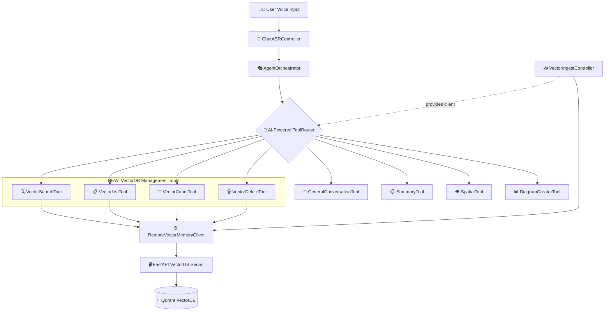

# 🏗️ VectorDB CRUD Tools - Architecture & Implementation Guide

**Date:** 2026-02-08  
**Purpose:** Integrate VectorDB CRUD operations into Agent Tool System

---

## 📊 **Architecture Overview**

### **Your Current System Flow:**

```
User Voice Input (Spectacles)
    ↓
ChatASRController (transcribe)
    ↓
AgentOrchestrator (process query)
    ↓
ToolRouter (AI-powered routing)
    ↓
[Tool Selected Based on Query]
    ↓
Tool Execution → Result
    ↓
ChatBridge → Display
```

### **Where VectorDB Tools Fit:**

```
ToolRouter {🧠 AI-Powered ToolRouter}
    ├── GeneralConversationTool (existing)
    ├── SummaryTool (existing)
    ├── SpatialTool (existing)
    ├── DiagramCreatorTool (existing)
    ├── DiagramUpdaterTool (existing)
    └── NEW: VectorDB Management Tools
        ├── VectorSearchTool  🔍 (semantic search)
        ├── VectorListTool    📋 (view all data)
        ├── VectorCountTool   🔢 (quick stats)
        └── VectorDeleteTool  🗑️ (remove data)
```

---

## 🎯 **Tool Architecture Pattern**

### **Standard Tool Structure:**

```typescript
export class YourTool {
  // 1. Tool Identity
  public readonly name = "tool_name"
  public readonly description = "What this tool does"
  
  // 2. Parameters Schema (OpenAI Function Calling format)
  public readonly parameters = {
    type: "object",
    properties: {
      param1: { type: "string", description: "..." },
      param2: { type: "number", description: "...", default: 5 }
    },
    required: ["param1"]
  }
  
  // 3. Dependencies
  private someService: SomeService
  
  // 4. Constructor
  constructor(dependencies...) {
    print("YourTool: Initialized")
  }
  
  // 5. Setter for late-bound dependencies
  public setSomeDependency(dep: Dependency): void {
    this.someService = dep
  }
  
  // 6. Execute method (REQUIRED)
  public async execute(args: Record<string, unknown>): Promise<{
    success: boolean
    result?: any
    error?: string
  }> {
    // Validate inputs
    // Call services
    // Return structured result
  }
}
```

---

## 🔧 **CRUD Tools Created**

### **1. VectorSearchTool** 🔍

**File:** `VectorSearchTool.ts`

**Purpose:** Semantic search on recorded data

**When ToolRouter selects it:**
- User asks: "what did I talk about AI"
- User asks: "find discussions about landing"
- User asks: "show me chunks about packages"

**Parameters:**
```typescript
{
  query: string,           // "tell me about machine learning"
  top_k: number,          // How many results (default: 5)
  min_score: number,      // Relevance threshold (default: 0.3)
  summarize_results: bool // AI summary of results (default: true)
}
```

**Returns:**
```typescript
{
  query: "machine learning",
  matches: [
    {
      rank: 1,
      score: 0.87,
      text_preview: "Machine learning is...",
      full_text: "Full content...",
      created_at: "2026-02-08 01:56:15"
    }
  ],
  match_count: 5,
  ai_summary: "You discussed machine learning concepts...",
  message: "Found 5 relevant chunks"
}
```

**Key Features:**
- ✅ Semantic search (by meaning, not exact text)
- ✅ Relevance filtering (min_score)
- ✅ AI-generated summary of results
- ✅ Formatted timestamps

---

### **2. VectorListTool** 📋

**File:** `VectorListTool.ts`

**Purpose:** View all recorded chunks

**When ToolRouter selects it:**
- User asks: "show me all my recordings"
- User asks: "what data do I have"
- User asks: "list everything I've recorded"

**Parameters:**
```typescript
{
  limit: number,      // Max chunks to show (default: 50)
  offset: number,     // Skip N chunks (pagination, default: 0)
  showPreview: bool   // Include text preview (default: true)
}
```

**Returns:**
```typescript
{
  chunks: [
    {
      index: 1,
      chunk_id: "chunk_123",
      point_id: 12345678901234567890,
      created_at: "2026-02-08 01:56:15",
      text_length: 320,
      preview: "First 100 chars..."
    }
  ],
  total_count: 50,
  showing_count: 10,
  has_more: true,
  current_page: 1,
  message: "Showing 10 of 50 total chunks (more available)"
}
```

**Key Features:**
- ✅ Pagination support
- ✅ Text previews
- ✅ Timestamps
- ✅ Total count

---

### **3. VectorCountTool** 🔢

**File:** `VectorCountTool.ts`

**Purpose:** Quick stats about stored data

**When ToolRouter selects it:**
- User asks: "how many recordings do I have"
- User asks: "what's in my database"
- User asks: "storage stats"

**Parameters:**
```typescript
{
  detailed: bool  // Include quality analysis (default: false)
}
```

**Returns:**
```typescript
{
  count: 50,
  message: "VectorDB contains 50 chunks",
  statistics?: {  // Only if detailed=true
    average_chunk_size: 315,
    total_characters_sampled: 3150,
    sample_size: 10,
    time_span_minutes: 5,
    oldest_chunk: "2026-02-08 01:50:00",
    newest_chunk: "2026-02-08 01:55:00"
  }
}
```

**Key Features:**
- ✅ Fast count query
- ✅ Optional detailed stats
- ✅ Quality metrics
- ✅ Time span analysis

---

### **4. VectorDeleteTool** 🗑️

**File:** `VectorDeleteTool.ts`

**Purpose:** Remove specific chunks

**When ToolRouter selects it:**
- User says: "delete the first recording"
- User says: "remove old chunks"
- User says: "clear chunk_123"

**Parameters:**
```typescript
{
  chunk_ids: string[],  // ["chunk_123", "chunk_456"]
  confirm: bool         // Safety flag (REQUIRED = true)
}
```

**Returns:**
```typescript
{
  deleted_count: 2,
  chunk_ids: ["chunk_123", "chunk_456"],
  message: "Successfully deleted 2 chunks"
}
```

**Key Features:**
- ✅ Safety confirmation required
- ✅ Bulk deletion support
- ✅ Returns count deleted
- ✅ Error handling

---

## 🔌 **Integration Steps**

### **Step 1: Register Tools in ToolRouter**

**File:** `ToolRouter.ts`

```typescript
import { VectorSearchTool } from "./VectorSearchTool"
import { VectorListTool } from "./VectorListTool"
import { VectorCountTool } from "./VectorCountTool"
import { VectorDeleteTool } from "./VectorDeleteTool"

export class ToolRouter {
  // Add properties
  private vectorSearchTool: VectorSearchTool
  private vectorListTool: VectorListTool
  private vectorCountTool: VectorCountTool
  private vectorDeleteTool: VectorDeleteTool
  
  constructor(languageInterface: AgentLanguageInterface, ...) {
    // Initialize tools
    this.vectorSearchTool = new VectorSearchTool(languageInterface)
    this.vectorListTool = new VectorListTool()
    this.vectorCountTool = new VectorCountTool()
    this.vectorDeleteTool = new VectorDeleteTool()
    
    // Index tools
    this.indexTool(
      this.vectorSearchTool.name,
      this.vectorSearchTool.description,
      [
        "semantic search",
        "find chunks by meaning",
        "search recordings",
        "what did I say about X"
      ],
      [
        "user wants to find specific content",
        "user asks 'what did I say about...'",
        "user searches for topics in recordings"
      ],
      this.vectorSearchTool
    )
    
    this.indexTool(
      this.vectorListTool.name,
      this.vectorListTool.description,
      [
        "list all chunks",
        "view recordings",
        "show all data",
        "what's stored"
      ],
      [
        "user wants to see all recordings",
        "user asks 'what do I have'",
        "user requests data overview"
      ],
      this.vectorListTool
    )
    
    this.indexTool(
      this.vectorCountTool.name,
      this.vectorCountTool.description,
      [
        "count chunks",
        "storage stats",
        "how many recordings",
        "database size"
      ],
      [
        "user asks 'how many...'",
        "user wants storage statistics",
        "user checks database state"
      ],
      this.vectorCountTool
    )
    
    this.indexTool(
      this.vectorDeleteTool.name,
      this.vectorDeleteTool.description,
      [
        "delete chunks",
        "remove recordings",
        "clear data",
        "cleanup storage"
      ],
      [
        "user wants to delete specific chunks",
        "user requests data cleanup",
        "user removes old recordings"
      ],
      this.vectorDeleteTool
    )
  }
  
  // Add method to connect RemoteVectorMemoryClient
  public setVectorClient(client: RemoteVectorMemoryClient): void {
    this.vectorSearchTool.setRemoteClient(client)
    this.vectorListTool.setRemoteClient(client)
    this.vectorCountTool.setRemoteClient(client)
    this.vectorDeleteTool.setRemoteClient(client)
    
    print("ToolRouter: ✅ Connected VectorDB client to all vector tools")
  }
}
```

---

### **Step 2: Wire in AgentOrchestrator**

**File:** `AgentOrchestrator.ts`

```typescript
// In constructor or initialization method:

// Get RemoteVectorMemoryClient from VectorIngestController
if (this.vectorIngestController && this.vectorIngestController.remoteClient) {
  this.toolRouter.setVectorClient(this.vectorIngestController.remoteClient)
  print("AgentOrchestrator: ✅ Wired VectorDB client to ToolRouter")
}
```

---

### **Step 3: Expose RemoteClient in VectorIngestController**

**File:** `VectorIngestController.ts`

```typescript
export class VectorIngestController extends BaseScriptComponent {
  // Make remoteClient accessible
  public get remoteClient(): RemoteVectorMemoryClient | null {
    return this.useRemoteVectorService ? this.remoteClient : null
  }
  
  // ... rest of the class
}
```

---

## 🎯 **How ToolRouter Selects Tools**

### **AI-Powered Routing Decision:**

When user says: **"show me what I talked about AI"**

```typescript
// ToolRouter analyzes query with AI
const toolSelection = await this.selectToolWithAI(userQuery, conversationContext)

// AI considers:
// - Query intent: "show me" + "talked about" = search intent
// - Topic: "AI" = specific topic to search
// - Available tools and their capabilities
// - Conversation history

// AI selects: vector_search_tool
// With parameters: {query: "AI", top_k: 5}
```

When user says: **"how many recordings do I have"**

```typescript
// AI routing considers:
// - "how many" = count intent
// - "recordings" = chunks in database
// - Best match: vector_count_tool

// AI selects: vector_count_tool
// With parameters: {detailed: false}
```

---

## 💡 **Smart Routing Examples**

| User Query | Tool Selected | Reason |
|------------|---------------|--------|
| "what did I say about machine learning" | `vector_search_tool` | Semantic search intent |
| "show all my recordings" | `vector_list_tool` | View all data intent |
| "how much data do I have" | `vector_count_tool` | Stats query |
| "delete chunk_123" | `vector_delete_tool` | Specific deletion |
| "tell me about AI" (no recordings) | `general_conversation` | Fallback |
| "explain neural networks" | `general_conversation` | General knowledge |
| "create a diagram about..." | `diagram_creator` | Visualization intent |

---

## 🔑 **Critical Design Decisions**

### **1. Why Separate Tools?**

**Option A: One "VectorDB Tool" with operations**
```typescript
// ❌ BAD: One tool, multiple operations
vectorDBTool.execute({operation: "search", query: "..."})
```

**Option B: Separate tools per operation** ✅ (Our choice)
```typescript
// ✅ GOOD: Dedicated tools
vectorSearchTool.execute({query: "..."})
vectorListTool.execute({limit: 50})
```

**Why Option B is better:**
- AI routing is more accurate (clearer intent)
- Each tool has focused purpose
- Better logging and debugging
- Easier to maintain
- Matches existing architecture pattern

---

### **2. Why RemoteClient in Each Tool?**

**Architecture:**
```
VectorIngestController
    └── RemoteVectorMemoryClient (manages WebSocket)
            ↓
    ToolRouter.setVectorClient(client)
            ↓
    Each VectorDB tool receives same client instance
```

**Benefits:**
- Single WebSocket connection shared across tools
- Consistent state management
- No duplicate connections
- Centralized error handling

---

### **3. When to Use Each Tool?**

#### **VectorSearchTool** 🔍
**Use when:**
- User wants to find content by meaning
- Query contains: "what did I say", "find", "search", "show me about"
- User references specific topics

**Examples:**
- ✅ "what did I talk about landing"
- ✅ "find discussions about packages"
- ✅ "show chunks mentioning reading"

---

#### **VectorListTool** 📋
**Use when:**
- User wants to see all data
- Query contains: "show all", "list", "what do I have", "view recordings"
- User wants overview

**Examples:**
- ✅ "show me all my recordings"
- ✅ "list everything I've said"
- ✅ "what data do I have"

---

#### **VectorCountTool** 🔢
**Use when:**
- User asks for statistics
- Query contains: "how many", "how much", "stats", "count"
- User checks storage state

**Examples:**
- ✅ "how many recordings do I have"
- ✅ "what's my storage count"
- ✅ "show me stats"

---

#### **VectorDeleteTool** 🗑️
**Use when:**
- User wants to remove data
- Query contains: "delete", "remove", "clear", "cleanup"
- User references specific chunk IDs

**Examples:**
- ✅ "delete chunk_123"
- ✅ "remove old recordings"
- ✅ "clear all data"

**Safety:** Requires `confirm: true` parameter!

---

## 📋 **Implementation Checklist**

### **Files Created:**
- ✅ `VectorSearchTool.ts` - Semantic search
- ✅ `VectorListTool.ts` - List all chunks
- ✅ `VectorCountTool.ts` - Get statistics
- ✅ `VectorDeleteTool.ts` - Delete chunks

### **Files to Modify:**

#### **1. ToolRouter.ts**
```typescript
// Import new tools
import { VectorSearchTool } from "./VectorSearchTool"
import { VectorListTool } from "./VectorListTool"
import { VectorCountTool } from "./VectorCountTool"
import { VectorDeleteTool } from "./VectorDeleteTool"

// Add properties
private vectorSearchTool: VectorSearchTool
private vectorListTool: VectorListTool
private vectorCountTool: VectorCountTool
private vectorDeleteTool: VectorDeleteTool

// Initialize in constructor
this.vectorSearchTool = new VectorSearchTool(languageInterface)
this.vectorListTool = new VectorListTool()
this.vectorCountTool = new VectorCountTool()
this.vectorDeleteTool = new VectorDeleteTool()

// Index tools
this.indexTool("vector_search_tool", "...", [...capabilities], [...useWhen], this.vectorSearchTool)
this.indexTool("vector_list_tool", "...", [...capabilities], [...useWhen], this.vectorListTool)
this.indexTool("vector_count_tool", "...", [...capabilities], [...useWhen], this.vectorCountTool)
this.indexTool("vector_delete_tool", "...", [...capabilities], [...useWhen], this.vectorDeleteTool)

// Add connection method
public setVectorClient(client: RemoteVectorMemoryClient): void {
  this.vectorSearchTool.setRemoteClient(client)
  this.vectorListTool.setRemoteClient(client)
  this.vectorCountTool.setRemoteClient(client)
  this.vectorDeleteTool.setRemoteClient(client)
  print("ToolRouter: Connected VectorDB client to all tools")
}
```

#### **2. AgentOrchestrator.ts**
```typescript
// Add reference to VectorIngestController
@input
vectorIngestController: VectorIngestController | null = null

// In initialize() method
if (this.vectorIngestController) {
  const client = this.vectorIngestController.getRemoteClient()
  if (client) {
    this.toolRouter.setVectorClient(client)
    print("AgentOrchestrator: Wired VectorDB to tools")
  }
}
```

#### **3. VectorIngestController.ts**
```typescript
// Add getter for remoteClient
public getRemoteClient(): RemoteVectorMemoryClient | null {
  return this.useRemoteVectorService ? this.remoteClient : null
}
```

---

## 🎬 **Example Usage Scenarios**

### **Scenario 1: User Searches Their Recordings**

```
User: "what did I say about landing"
    ↓
AgentOrchestrator receives query
    ↓
ToolRouter analyzes with AI
    ↓
AI decides: vector_search_tool (high confidence)
    ↓
VectorSearchTool.execute({
  query: "landing",
  top_k: 5,
  min_score: 0.3
})
    ↓
RemoteVectorMemoryClient.search("landing", 5)
    ↓
Server: Embed query → Search Qdrant → Return matches
    ↓
VectorSearchTool formats results + AI summary
    ↓
ChatBridge displays results to user
```

---

### **Scenario 2: User Checks Storage**

```
User: "how many recordings do I have"
    ↓
ToolRouter → AI routing
    ↓
AI decides: vector_count_tool
    ↓
VectorCountTool.execute({detailed: false})
    ↓
RemoteVectorMemoryClient.getChunkCount()
    ↓
Server: Query Qdrant collection info
    ↓
Returns: 47 chunks
    ↓
Display: "You have 47 recordings in your database"
```

---

### **Scenario 3: User Deletes Data**

```
User: "delete chunk_1770544575757_6070"
    ↓
ToolRouter → AI routing
    ↓
AI decides: vector_delete_tool
    ↓
VectorDeleteTool.execute({
  chunk_ids: ["chunk_1770544575757_6070"],
  confirm: true
})
    ↓
RemoteVectorMemoryClient.deleteChunks([...])
    ↓
Server: Convert to point_id → Delete from Qdrant
    ↓
Returns: deleted_count = 1
    ↓
Display: "Successfully deleted 1 chunk"
```

---

## 🎨 **Updated Architecture Diagram**



---

## 📊 **Tool Registration Details**

### **VectorSearchTool Capabilities:**
```typescript
capabilities: [
  "semantic search in VectorDB",
  "find chunks by meaning",
  "search recorded content",
  "query lecture transcripts"
]

useWhen: [
  "user wants to find specific content in recordings",
  "user asks 'what did I say about X'",
  "user searches for topics",
  "user queries recorded data by meaning"
]
```

### **VectorListTool Capabilities:**
```typescript
capabilities: [
  "list all chunks in VectorDB",
  "view all recordings",
  "show stored data",
  "browse chunks with pagination"
]

useWhen: [
  "user wants to see all recordings",
  "user asks 'what data do I have'",
  "user requests overview of storage",
  "user browses recorded content"
]
```

### **VectorCountTool Capabilities:**
```typescript
capabilities: [
  "count total chunks in VectorDB",
  "get storage statistics",
  "check database size",
  "show data metrics"
]

useWhen: [
  "user asks 'how many recordings'",
  "user requests storage stats",
  "user checks database state",
  "user wants quick overview"
]
```

### **VectorDeleteTool Capabilities:**
```typescript
capabilities: [
  "delete specific chunks from VectorDB",
  "remove recordings by ID",
  "cleanup old data",
  "clear selected chunks"
]

useWhen: [
  "user wants to delete specific chunks",
  "user requests data cleanup",
  "user removes unwanted recordings",
  "user clears old data"
]
```

---

## 🔒 **Safety Considerations**

### **1. Delete Requires Confirmation**
```typescript
// ❌ Will fail
vectorDeleteTool.execute({chunk_ids: ["chunk_123"]})

// ✅ Will succeed
vectorDeleteTool.execute({chunk_ids: ["chunk_123"], confirm: true})
```

### **2. Count is Always Safe**
- Read-only operation
- No side effects
- Fast execution

### **3. List Has Pagination**
- Limits response size
- Prevents memory overload
- Supports large datasets

### **4. Search Has Min Score**
- Filters irrelevant results
- Returns only meaningful matches
- User can adjust threshold

---

## 🚀 **Next Steps**

1. **Modify ToolRouter.ts** - Register new tools
2. **Modify AgentOrchestrator.ts** - Wire VectorIngestController
3. **Modify VectorIngestController.ts** - Expose remoteClient getter
4. **Restart Lens Studio** - Load new tools
5. **Test voice commands:**
   - "what did I say about landing"
   - "show me all my recordings"
   - "how many chunks do I have"

---

## 📚 **Summary**

**What You Get:**
- ✅ 4 new tools for VectorDB management
- ✅ Seamless integration with existing ToolRouter
- ✅ AI-powered routing (no manual command parsing)
- ✅ Full CRUD operations via voice
- ✅ Safe deletion with confirmation
- ✅ Comprehensive logging

**User Experience:**
- Natural voice commands
- AI understands intent
- Automatic tool selection
- Results displayed in chat

**Your VectorDB is now fully manageable via voice commands! 🎉**

---

Want me to proceed with implementing the ToolRouter, AgentOrchestrator, and VectorIngestController modifications?
