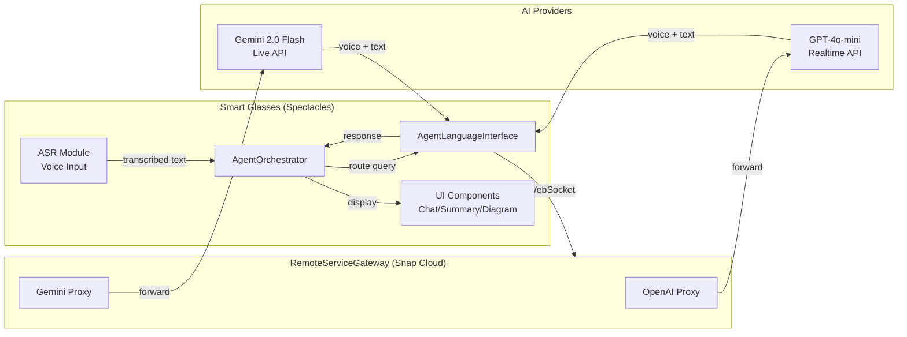
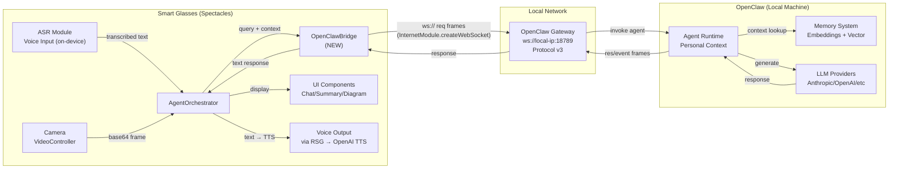
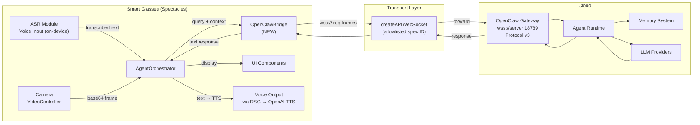
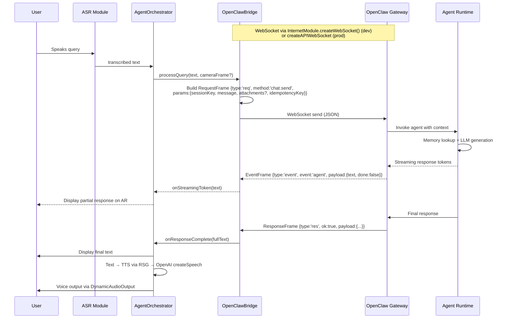
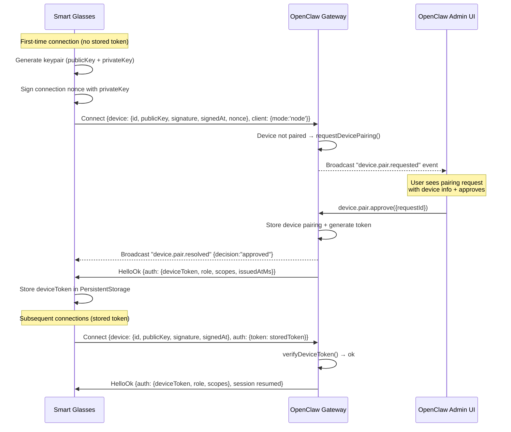

# System Design & Architecture

## Architecture Overview
**What is the high-level system structure?**

### Current Architecture (Direct AI Provider)


### Target Architecture — Dev Phase (Extended Permissions + Direct WebSocket)


> **Key**: In dev mode, Extended Permissions allows `InternetModule.createWebSocket()` to connect to ANY endpoint while retaining camera + audio access. The lens cannot be published in this mode.

### Target Architecture — Production Phase (Allowlisted or Proxy)


> **Key**: In production, `createAPIWebSocket` with a Snap-allowlisted specification ID preserves camera + audio access AND allows publishing. Alternative: proxy through RSG-supported endpoints.

### Key Components and Responsibilities

| Component | Responsibility | New/Modified |
|-----------|---------------|-------------|
| `OpenClawBridge` | WebSocket connection to OpenClaw, protocol v3 implementation, RPC call management | **NEW** |
| `OpenClawProtocol` | Frame serialization/deserialization, message ID tracking, validation | **NEW** |
| `OpenClawAuth` | Device pairing, token management, reconnection auth | **NEW** |
| `AgentOrchestrator` | Route queries through OpenClawBridge instead of ToolRouter when connected | **MODIFIED** |
| `AgentLanguageInterface` | TTS coordination — when OpenClaw mode active, use text→speech via RSG (NOT add OpenClaw as an LLM provider) | **MODIFIED** |
| `ChatBridge` | Handle streaming events from OpenClaw for real-time UI updates | **MODIFIED** |

### Technology Stack
- **Transport (Dev)**: WebSocket via `InternetModule.createWebSocket('ws://local-ip:18789')` with Extended Permissions
- **Transport (Prod)**: WebSocket via `createAPIWebSocket` with Snap-allowlisted specification ID
- **TTS**: Client-side via RSG → OpenAI `createSpeech` API (text returned from OpenClaw → spoken locally)
- **Protocol**: OpenClaw Gateway Protocol v3 (Connect → HelloOk → req/res/event)
- **Serialization**: JSON (matching OpenClaw's existing frame format)
- **Auth**: Device token-based (leveraging OpenClaw's `device.pair.*` / `device.token.*`)
- **Client Runtime**: TypeScript ES2021 on Lens Studio

## Data Models
**What data do we need to manage?**

### Core Entities

```typescript
// Connection state for the OpenClaw bridge
interface OpenClawConnectionState {
    status: 'disconnected' | 'connecting' | 'authenticating' | 'connected' | 'reconnecting';
    serverUrl: string;
    deviceToken: string | null;
    sessionKey: string | null;
    connId: string | null;
    protocolVersion: number;
    lastHeartbeat: number;
    reconnectAttempts: number;
}

// OpenClaw protocol frame types (client-side representation)
interface RequestFrame {
    type: 'req';
    id: string;       // unique message ID for response correlation
    method: string;    // RPC method name (e.g., "chat.send")
    params: Record<string, unknown>;
}

interface ResponseFrame {
    type: 'res';
    id: string;        // correlates to request ID
    ok: boolean;
    payload?: unknown;
    error?: { code: number; message: string };
}

interface EventFrame {
    type: 'event';
    event: string;     // event name (e.g., "agent")
    payload: unknown;
}

// ConnectParams for OpenClaw handshake (matches actual protocol schema)
interface OpenClawConnectParams {
    minProtocol: number;       // minimum supported protocol version
    maxProtocol: number;       // maximum supported protocol version
    client: {
        id: string;            // e.g., 'spectacles-v1'
        displayName?: string;  // e.g., 'My Spectacles'
        version: string;       // app version
        platform: string;      // 'spectacles', 'meta-rayban', etc.
        deviceFamily?: string; // 'smart-glass'
        mode: string;          // 'node' (using existing mode; 'smart-glass' mode TBD)
        instanceId?: string;   // unique per-device instance
    };
    device?: {                 // Device auth (public key crypto)
        id: string;            // stable device identifier
        publicKey: string;     // device's public key
        signature: string;     // signed nonce/timestamp
        signedAt: number;      // signature timestamp (ms)
        nonce?: string;        // required for remote (non-local) connections
    };
    auth?: {                   // Token auth (subsequent connections)
        token: string;         // deviceToken from previous HelloOk
    };
}

// HelloOk response from server
interface OpenClawHelloOk {
    version: number;
    commit?: string;
    features: {
        methods: string[];     // available RPC methods
        events: string[];      // subscribable events
    };
    auth?: {
        deviceToken: string;   // store this for subsequent connections
        role: string;
        scopes: string[];
        issuedAtMs?: number;
    };
}

// Query payload sent via chat.send (matches actual ChatSendParams schema)
interface GlassQuery {
    sessionKey: string;         // OpenClaw session key
    message: string;            // user's text query
    attachments?: Array<{       // camera frames, files, etc.
        type?: string;          // 'image'
        mimeType?: string;      // 'image/jpeg'
        fileName?: string;
        content?: unknown;      // base64 string for images
    }>;
    timeoutMs?: number;         // request timeout hint for long-running agents
    idempotencyKey: string;     // unique per request (prevents duplicates)

    // Client-side metadata (not sent to OpenClaw, used internally)
    _displayMode?: 'chat' | 'summary' | 'diagram';
    _maxResponseLength?: number;
}
```

### Data Flow Between Components



## API Design
**How do components communicate?**

### OpenClaw RPC Methods Used by Glass Client

| Method | Direction | Purpose | Params |
|--------|-----------|---------|--------|
| `Connect` (handshake) | Glass → Server | Connection with device auth + pairing | `{minProtocol, maxProtocol, client: {id, mode:'node', platform, version}, device: {id, publicKey, signature, signedAt, nonce?}, auth?: {token}}` |
| `HelloOk` (handshake) | Server → Glass | Confirms connection, returns token | `{version, commit, features: {methods, events}, auth?: {deviceToken, role, scopes, issuedAtMs}}` |
| `chat.send` | Glass → Server | Send user query with optional attachments | `{sessionKey, message, attachments?: [{type, mimeType, fileName, content}], timeoutMs?, idempotencyKey}` |
| `chat.abort` | Glass → Server | Cancel in-progress response | `{sessionKey}` |
| `chat.history` | Glass → Server | Retrieve conversation history | `{sessionKey, limit?}` |
| `sessions.list` | Glass → Server | List available sessions | `{}` |
| `sessions.patch` | Glass → Server | Update session metadata | `{sessionKey, title?}` |
| `device.token.rotate` | Glass → Server | Rotate device auth token | `{deviceId, role}` |
| `config.get` | Glass → Server | Get agent config | `{keys?}` |
| `agent` (event) | Server → Glass | Streaming agent response tokens | `{text?, done?, toolCall?}` |
| `device.pair.requested` (event) | Server → broadcast | New pairing request created | `{requestId, deviceId, platform, clientMode}` |
| `device.pair.resolved` (event) | Server → Glass | Pairing decision | `{requestId, deviceId, decision: 'approved'\|'rejected', ts}` |
| `tick` (event) | Server → Glass | Heartbeat | `{}` |
| `shutdown` (event) | Server → Glass | Server shutting down | `{restartIn?}` |

> **Note on `client.mode`**: OpenClaw currently supports modes: `webchat`, `cli`, `ui`, `backend`, `node`, `probe`, `test`. Smart glasses will initially use `node` mode. A `smart-glass` mode may be added to OpenClaw's `GATEWAY_CLIENT_MODES` in a future protocol extension.

> **Note on camera frames**: Camera images are sent as `attachments` in `chat.send`, using `{type: 'image', mimeType: 'image/jpeg', content: '<base64>'}` format.

### Internal Interfaces

```typescript
// OpenClawBridge public API
interface IOpenClawBridge {
    // Lifecycle
    connect(serverUrl: string, deviceToken?: string): Promise<void>;
    disconnect(): Promise<void>;
    isConnected(): boolean;

    // Queries
    sendQuery(query: GlassQuery): Promise<string>;
    abortQuery(): Promise<void>;

    // Session
    getActiveSession(): string | null;
    listSessions(): Promise<SessionInfo[]>;

    // Events
    onConnectionStateChanged: Event<OpenClawConnectionState>;
    onStreamingResponse: Event<{ text: string; done: boolean }>;
    onAgentEvent: Event<EventFrame>;
    onError: Event<{ code: number; message: string }>;
}
```

### Authentication Flow

Device authentication uses public key cryptography during the `Connect` handshake. The pairing flow is built into the connection itself — there is no separate `device.pair.request` RPC call.



**Key details from OpenClaw source**:
- Device auth uses `publicKey` + `signature` + `signedAt` + optional `nonce` (required for remote/non-local connections)
- Local clients (`isLocalClient`) are auto-approved silently
- Token is returned in `HelloOk.auth.deviceToken` — NOT via a separate RPC call
- Token includes `role` and `scopes` (e.g., `operator.read`, `operator.write`)
- Token can be rotated via `device.token.rotate` RPC and revoked via `device.token.revoke`

## Component Breakdown
**What are the major building blocks?**

### New Components

#### 1. `OpenClawBridge.ts` (Main Bridge)
- Manages WebSocket connection lifecycle via RemoteServiceGateway
- Implements OpenClaw Protocol v3 client-side
- Handles Connect → HelloOk handshake
- Sends `req` frames, correlates `res` frames by message ID
- Processes `event` frames (streaming agent tokens, notifications)
- Auto-reconnection with exponential backoff (1s, 2s, 4s, 8s, max 30s)
- Heartbeat monitoring (miss 3 ticks → reconnect)

#### 2. `OpenClawProtocol.ts` (Protocol Handler)
- Frame serialization: TypeScript objects → JSON strings
- Frame deserialization: JSON strings → typed frames
- Message ID generation (UUID v4 or incrementing counter)
- Request/response correlation map with timeout (15s default)
- Frame type validation
- Error code mapping

#### 3. `OpenClawAuth.ts` (Authentication Manager)
- Device token storage/retrieval from PersistentStorage
- First-time pairing flow orchestration
- Token refresh handling
- Connection credential preparation

#### 4. `OpenClawConfig.ts` (Configuration)
- Server URL configuration
- Connection parameters (timeouts, retry limits)
- Feature flags (enable/disable camera forwarding, voice mode)
- Display constraint communication to server

### Modified Components

#### 5. `AgentOrchestrator.ts` (Modified)
- Add OpenClaw mode toggle (direct AI vs. OpenClaw bridge)
- When OpenClaw connected: route `processUserQuery()` through `OpenClawBridge.sendQuery()` instead of `ToolRouter`
- Handle streaming response events for progressive display
- Fallback to direct mode if OpenClaw disconnects

#### 6. `AgentLanguageInterface.ts` (Modified)
- When OpenClaw mode active: TTS uses existing `speak()` method to convert OpenClaw text response to voice via RSG (OpenAI `createSpeech` or Gemini)
- OpenClaw is NOT added as an LLM "provider" — it's an orchestrator, not a language model. The bridge pattern (Decision 5) handles the routing.
- Camera frame capture still uses `VideoController` but forwards via OpenClawBridge as `attachments`

#### 7. `ChatBridge.ts` (Modified)
- Subscribe to `OpenClawBridge.onStreamingResponse` for real-time UI updates
- Handle progressive text display as tokens arrive from OpenClaw

### Third-Party Integrations
- **RemoteServiceGateway.lspkg**: WebSocket creation via `remoteServiceModule.createWebSocket('wss://')`
- **OpenClaw Server**: Gateway at `wss://<server-host>:<port>` running protocol v3
- **Lens Studio ASR**: Continues to handle on-device voice transcription (no change)

## Design Decisions
**Why did we choose this approach?**

### Decision 1: Text-First with Client-Side TTS (vs. Streaming Audio from OpenClaw)
**Chosen**: ASR on-device → text to OpenClaw → text response → client-side TTS
**Rationale**:
- RemoteServiceGateway already provides high-quality TTS via OpenAI/Gemini voice APIs
- Streaming raw audio through OpenClaw adds complexity (audio codec negotiation, latency)
- Text responses can be displayed on AR simultaneously with voice playback
- OpenClaw's agent runtime is text-native; adding audio streaming would require server changes (out of scope)

**Alternative rejected**: Stream audio bidirectionally through OpenClaw
- Would require OpenClaw to proxy Realtime API audio streams
- Adds server-side complexity and latency
- Breaks the non-goal of not modifying OpenClaw server code

### Decision 2: Dual-Mode Operation (OpenClaw + Direct Fallback)
**Chosen**: AgentOrchestrator supports both OpenClaw mode and direct AI mode
**Rationale**:
- If OpenClaw is unreachable, the glasses should still work (degraded but functional)
- Allows gradual migration — not all features need to go through OpenClaw immediately
- Summary ASR capture can continue working independently of OpenClaw

### Decision 3: On-Device ASR (vs. Server-Side Transcription)
**Chosen**: Keep ASR on the Spectacles device using `AsrModule`
**Rationale**:
- ASR is already working well with 40+ language support
- Reduces data sent over network (text vs. audio stream)
- Lower latency for transcription (no round-trip)
- RemoteServiceGateway WebSocket bandwidth is better used for responses

### Decision 4: Reuse OpenClaw's Existing Device Pairing
**Chosen**: Use `device.pair.*` and `device.token.*` RPC methods
**Rationale**:
- Already built and tested for mobile devices
- Supports secure token-based auth with scopes
- No new server-side auth code needed

### Decision 5: New OpenClawBridge Module (vs. Modifying AgentLanguageInterface)
**Chosen**: Create a separate `OpenClawBridge` module instead of adding OpenClaw as a provider in `AgentLanguageInterface`
**Rationale**:
- OpenClaw is fundamentally different from OpenAI/Gemini — it's an agent orchestrator, not just an LLM
- `AgentLanguageInterface` manages raw LLM connections; OpenClaw manages sessions, memory, tools, and agents
- Separation of concerns: `OpenClawBridge` handles protocol + session, `AgentOrchestrator` handles routing
- Bridge pattern matches existing codebase architecture (SummaryBridge, ChatBridge, DiagramBridge)

## Non-Functional Requirements
**How should the system perform?**

### Performance Targets
- **First-word latency**: <2s from query send to first streaming token displayed
- **Full response latency**: <5s for typical conversational queries
- **Connection establishment**: <3s from app launch to authenticated OpenClaw connection
- **Reconnection**: <5s automatic reconnection after disconnection
- **Camera frame forwarding**: <500ms from capture to send (including base64 encoding)

### Scalability Considerations
- Single OpenClaw server handles one user's glass device (personal assistant model)
- Connection pool: 1 WebSocket per glass device to OpenClaw
- Message queue: In-flight request limit of 3 concurrent RPCs
- Event buffer: Max 50 queued events before oldest are dropped

### Security Requirements
- All communication over `wss://` (TLS) — enforced by Snap's publication requirements
- Device tokens stored in Spectacles PersistentStorage (encrypted by OS)
- No API keys or credentials transmitted in RPC payloads (auth via connection handshake)
- Pairing codes expire after 5 minutes
- Token scopes limited to `operator.read` + `operator.write` (no admin)

### Reliability
- Auto-reconnect with exponential backoff (max 30s, max 10 attempts before giving up)
- Heartbeat monitoring: 3 missed ticks → reconnect
- Request timeout: 15s per RPC call
- Graceful shutdown handling (`shutdown` event from server)
- Local fallback mode when OpenClaw unreachable
