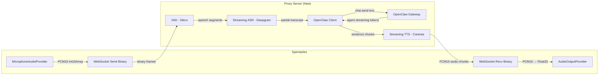

# Design: Streaming Voice Bridge

## Architecture Overview

### Current Architecture (Sequential)
```
Spectacles                          OpenClaw Server
┌──────────┐    text JSON     ┌──────────────────┐
│ AsrModule │──────────────►  │ chat.send(text)  │
│ (on-device│   WebSocket     │      │           │
│  ASR)     │                 │      ▼           │
│           │                 │  LLM generates   │
│ TTS Module│  ◄──────────── │  full response   │
│ (on-device│   text JSON     │                  │
│  TTS)     │                 └──────────────────┘
└──────────┘
```

### New Architecture (Streaming)


### Key Design Decision: Proxy Server

A **proxy server** sits between Spectacles and OpenClaw, handling audio ↔ text conversion:

```
Spectacles ──[WS: binary PCM16]──► Proxy Server ──[WS: text JSON]──► OpenClaw
Spectacles ◄──[WS: binary PCM16]── Proxy Server ◄──[WS: text JSON]── OpenClaw
```

**Why proxy instead of modifying OpenClaw?**
- OpenClaw's protocol is text-based (JSON request/response) — fundamental change to add binary audio
- Proxy can be built in Python (best ASR/TTS library support) while OpenClaw stays in its current stack
- Proxy isolates audio complexity (VAD, ASR, TTS, buffering) from AI logic
- Easy to swap ASR/TTS providers without touching OpenClaw
- Can reuse proxy for other clients (web, phone) later

## Data Models

### Audio Frame (Wire Format)

```
Binary WebSocket Frame:
┌────────────────────────────────────────┐
│ Raw PCM16 signed int16 little-endian   │
│ 16000 Hz, mono, 20ms chunks           │
│ 320 samples = 640 bytes per frame      │
└────────────────────────────────────────┘
```

### Control Messages (JSON Text Frames)

```typescript
// Client → Server
interface AudioSessionStart {
  type: "session.start"
  config: {
    sampleRate: number      // 16000
    channels: number        // 1
    encoding: "pcm16"
    vadMode: "server"       // server-side VAD
  }
}

interface AudioCommit {
  type: "input.commit"       // explicit end-of-utterance (optional, VAD handles this)
}

interface ResponseCancel {
  type: "response.cancel"    // barge-in: cancel current response
}

// Server → Client
interface TranscriptDelta {
  type: "transcript.delta"
  text: string              // partial ASR transcript
  isFinal: boolean
}

interface ResponseAudioDelta {
  type: "response.audio"    // followed by binary frame(s)
  sampleRate: number
  channels: number
}

interface ResponseTextDelta {
  type: "response.text.delta"
  delta: string             // LLM token for chat UI
  accumulated: string
}

interface ResponseDone {
  type: "response.done"
  text: string              // full response text
}

interface SessionError {
  type: "error"
  code: number
  message: string
}
```

### State Machine

```typescript
enum VoiceState {
  IDLE,           // Waiting for user to speak
  LISTENING,      // User is speaking, streaming audio to server
  COMMITTING,     // Speech ended, turn detector deciding if user is done
  PROCESSING,     // User done, server processing (ASR commit → LLM)
  RESPONDING,     // Agent is speaking, streaming audio to client
  INTERRUPTING,   // Barge-in detected, cancellation cascade in progress
}
```

### State Transitions

```
IDLE ──[VAD: speech_start (200ms sustained)]──► LISTENING
LISTENING ──[VAD: speech_end (550ms silence)]──► COMMITTING
COMMITTING ──[turn detector: complete]──► PROCESSING
COMMITTING ──[turn detector: continue, < 3s]──► LISTENING (extend)
COMMITTING ──[turn detector: timeout 3s]──► PROCESSING
PROCESSING ──[first audio chunk from server]──► RESPONDING
RESPONDING ──[response.done]──► IDLE
RESPONDING ──[barge-in: 500ms sustained speech]──► INTERRUPTING
INTERRUPTING ──[cancel cascade complete]──► LISTENING
LISTENING ──[15s no speech]──► IDLE (user away)
LISTENING ──[disconnect]──► IDLE
```

> **Design note (from LiveKit/Pipecat research)**: The COMMITTING state allows a turn detector
> model to evaluate whether the user's pause is mid-thought or end-of-turn. Phase 1 can skip
> this state (LISTENING → PROCESSING directly), but the architecture should support it.
> The INTERRUPTING state ensures clean cancellation cascade (abort LLM → stop TTS → flush
> audio → activate listening) completes atomically before re-entering LISTENING.
> See `docs/ai/implementation/knowledge-voice-bot-best-practices.md` for full analysis.

## API Design

### WebSocket Protocol (Spectacles ↔ Proxy Server)

Single WebSocket connection multiplexing audio and control:

| Direction | Frame Type | Content | Purpose |
|---|---|---|---|
| Client → Server | Binary | PCM16 bytes | Mic audio |
| Client → Server | Text | JSON control message | Session start, commit, cancel |
| Server → Client | Binary | PCM16 bytes | TTS audio |
| Server → Client | Text | JSON control message | Transcript, response text, errors |

**Binary frame identification**: All binary frames are audio. All text frames are JSON control messages. No ambiguity.

### Proxy Server ↔ OpenClaw

Reuses existing OpenClaw protocol (`OpenClawBridge`-equivalent in Python):
- Connect handshake (challenge-response, token auth)
- `chat.send` with text message (from ASR transcript)
- `agent` streaming events (token-by-token LLM output)
- `chat` events (final response)
- `chat.abort` for barge-in cancellation

## Component Breakdown

### Spectacles-Side Components (TypeScript / Lens Studio)

#### 1. `StreamingAudioBridge.ts` (NEW)
- Manages raw audio I/O: `MicrophoneAudioProvider` + `AudioOutputProvider`
- Sends PCM16 binary frames over WebSocket
- Receives and plays PCM16 binary frames from server
- Handles audio buffer management and jitter buffering
- Simple energy-gate VAD (don't send silence frames)

#### 2. `StreamingVoiceController.ts` (NEW, replaces JarvisController for streaming mode)
- State machine: IDLE → LISTENING → PROCESSING → RESPONDING
- Barge-in detection: if audio input detected during RESPONDING, send `response.cancel`
- Coordinates `StreamingAudioBridge` with chat UI events
- Falls back to text mode (`JarvisController`) on error

#### 3. `JarvisController.ts` (MODIFIED)
- Add `streamingMode: boolean` input toggle
- If streaming mode: delegate to `StreamingVoiceController`
- If text mode: use existing ASR + TTS flow (backward compatible)

#### 4. `OpenClawBridge.ts` (MODIFIED)
- Add support for binary WebSocket frames (currently only handles text/JSON)
- Add `sendBinary(data: Uint8Array)` method
- Route incoming binary frames to `StreamingAudioBridge`
- Existing JSON protocol unchanged

### Server-Side Components (Python)

#### 5. Proxy Server (`voice_proxy.py`, NEW)
- WebSocket server accepting connections from Spectacles
- Manages per-connection voice session state machine
- Coordinates VAD → ASR → OpenClaw → TTS → audio output pipeline

#### 6. VAD Module
- Silero VAD (PyTorch, ~2MB model, runs on ~1/8th CPU core)
- 4-state detection: QUIET → STARTING (200ms) → SPEAKING → STOPPING (550ms) → QUIET
- Production-tested parameters: activation_threshold=0.5, prefix_padding=500ms
- Energy pre-filter to skip obviously silent frames
- Adaptive noise floor with 30-second rolling window (Phase 2)

#### 7. ASR Module
- Deepgram streaming ASR (WebSocket API)
- Emits partial + final transcripts
- Supports endpointing with configurable silence threshold

#### 8. TTS Module
- Cartesia or ElevenLabs streaming TTS
- Input: text chunks (sentence-by-sentence from LLM)
- Output: PCM16 audio chunks streamed as they're synthesized
- Sentence boundary detection from LLM token stream

#### 9. OpenClaw Client (Python)
- Reimplements OpenClaw protocol v3 in Python
- Connect handshake, chat.send, event handling
- Subscribes to `agent` streaming events for token-by-token output
- Triggers TTS on sentence boundaries during streaming

## Design Decisions

### D1: Proxy server vs modifying OpenClaw
**Decision**: Proxy server
**Rationale**: Separation of concerns. OpenClaw handles AI logic; proxy handles audio I/O. Easier to iterate on audio pipeline without touching AI backend. Python has superior ASR/TTS library ecosystem.
**Trade-off**: Extra network hop (Spectacles → Proxy → OpenClaw), but both are on LAN so latency is ~1ms.

### D2: PCM16 raw audio vs Opus encoding
**Decision**: Raw PCM16 for v1
**Rationale**: Simpler implementation, no codec library needed on Spectacles. 64 KB/s bandwidth is fine for WiFi. Opus can be added later as optimization.
**Trade-off**: ~4x more bandwidth than Opus. Acceptable for WiFi; would be problematic for cellular.

### D3: Single WebSocket vs dual
**Decision**: Single WebSocket, multiplexed
**Rationale**: Simpler connection management, fewer failure modes. Binary/text frame types naturally separate audio from control. Spectacles' WebSocket API handles both.
**Trade-off**: Audio could theoretically starve control messages under load, but at 64 KB/s this is negligible.

### D4: Server-side VAD with device energy-gate
**Decision**: Hybrid
**Rationale**: Device energy-gate prevents sending silence (saves bandwidth + server CPU). Server Silero VAD provides accurate endpoint detection. Best of both worlds.
**Trade-off**: Slight complexity on both sides.

### D5: Sentence-boundary TTS chunking with adaptive pacing
**Decision**: Buffer LLM tokens until sentence boundary, then send to TTS. Use adaptive pacing (SentenceStreamPacer pattern) to batch sentences based on playback buffer depth.
**Rationale**: TTS quality is significantly better with complete sentences vs individual words. Adaptive pacing reduces waste from interruptions (less pre-synthesized audio discarded) and improves quality (TTS gets more context per request). Pattern proven in production by LiveKit agents SDK.
**Trade-off**: First sentence may be 5-15 words long, adding ~200ms of buffering. Acceptable given the quality improvement.
**Parameters**: `min_remaining_audio=3.0s`, `max_text_length=300 chars`, `min_sentence_len=20 chars`.

### D6: Barge-in with false interruption recovery
**Decision**: Require 500ms sustained speech before triggering interruption. After interrupting, wait 2.0s for STT to produce actual words. If no words arrive, auto-resume agent speech.
**Rationale**: Brief noises (cough, background, echo) frequently trigger VAD during agent speech. Without false interruption recovery, the agent stops for no reason and the conversation breaks. This is the #1 complaint in production voice bots (from LiveKit, Vapi, Pipecat research).
**Trade-off**: 500ms delay before interrupt takes effect. Acceptable — user perceives this as natural reaction time.

### D7: Turn detection beyond simple silence threshold (Phase 2)
**Decision**: Phase 1 uses VAD-only (550ms silence). Phase 2 adds lightweight turn detector model.
**Rationale**: Simple silence timeout creates a dilemma — too short cuts users off mid-thought, too long feels sluggish. LiveKit's EOU model (135MB, 50ms inference) reduces false interruptions by 85%. Pipecat's Smart Turn (8MB, 10ms inference) works on raw audio.
**Trade-off**: Extra model to deploy and run. CPU impact is minimal (~50ms per turn).
**Options**: Deepgram endpointing (free, built-in), Pipecat Smart Turn (8MB), LiveKit EOU (135MB).

## Non-Functional Requirements

### Performance Targets
| Metric | Target | Method |
|---|---|---|
| Time-to-first-audio | < 1000ms (p50) | End-of-speech → first audio chunk |
| Barge-in latency | < 300ms | Speech onset → agent audio stops |
| Audio chunk interval | 20ms | 50 frames/second, smooth playback |
| ASR latency | < 300ms | Audio → partial transcript |
| TTS first-chunk latency | < 200ms | Text → first audio chunk |

### Reliability
- Graceful degradation to text mode on audio pipeline failure
- WebSocket reconnection preserves streaming state
- Audio buffer underrun → insert silence (no clicks/pops)
- Server crash → Spectacles detects via heartbeat timeout → reconnects

### Security
- Audio data is transient — not stored on server (privacy)
- WebSocket connection uses existing OpenClaw auth token
- Permission Alerts ensure user consents to mic capture on every session
- No audio recording to disk (unless explicitly enabled for debugging)

### Battery & Resource
- Target: 15+ minute streaming session on Spectacles battery
- Mic capture: continuous during LISTENING/PROCESSING states only
- Audio output: active during RESPONDING state only
- Consider duty cycling: pause mic between utterances in IDLE state
