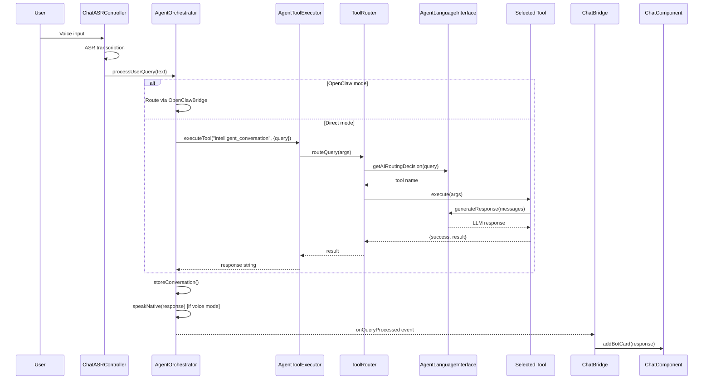
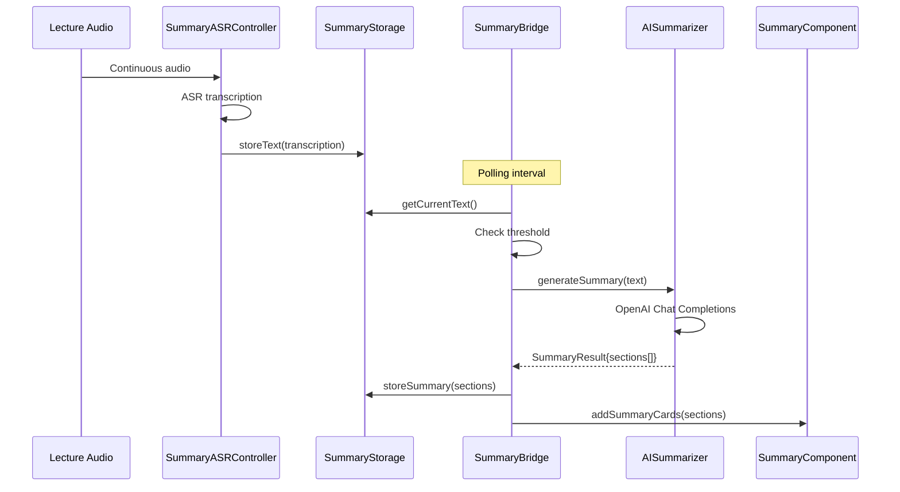
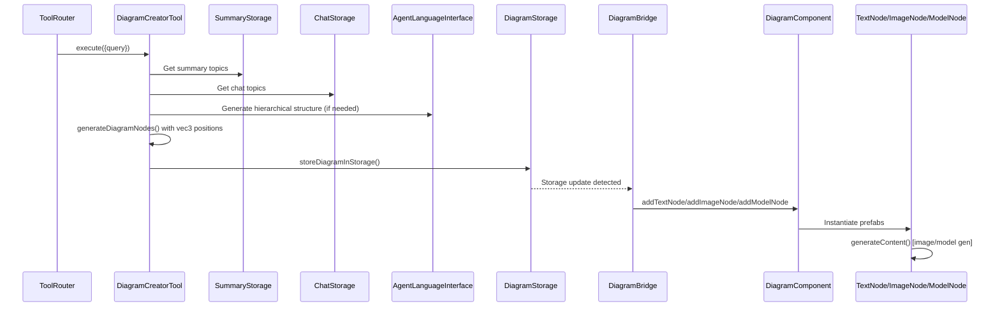
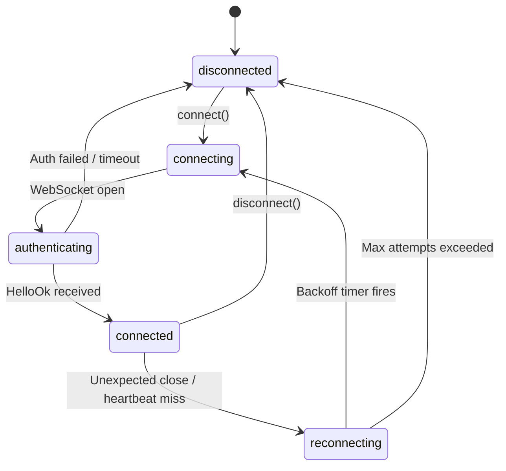

# Knowledge: AgenticMinder Repository (Excluding OpenClaw)

> **Analysis purpose:** Refactoring preparation
> **Analysis date:** 2026-02-26
> **Depth:** Full repository (excluding `openclaw/` directory)
> **Files analyzed:** 52 TypeScript source files across 9 modules

---

## Overview

**AgenticMinder** (internally "Agentic Playground") is an AI-powered educational assistant built for **Snap Spectacles (2024)** smart glasses. It runs inside **Lens Studio** as a TypeScript project targeting the Spectacles AR platform.

**What it does:** Transforms live lectures into an interactive AR learning experience with:
- Real-time speech-to-text lecture capture and auto-summarization
- Intelligent conversational AI with LLM-based tool routing
- 3D mind map / concept diagram generation (text + AI images + 3D models)
- Spatial awareness via live camera frame analysis (Gemini multimodal)
- Voice-first interaction (ASR + TTS) for hands-free use

**Language / Runtime:** TypeScript (ES2021 / CommonJS), Lens Studio runtime (NOT browser, NOT Node.js)

**AI Providers:** OpenAI (GPT-4o-mini, DALL-E 3, Realtime API), Google Gemini (2.0 Flash, Live API), Snap3D (text-to-3D)

**External Gateway:** OpenClaw (WebSocket JSON-RPC protocol, optional dual-mode routing)

---

## Implementation Details

### Module Architecture (9 modules, 52 files)

```
Assets/AgenticPlayground/Scripts/
├── Agents/       (5 files) — Agent orchestration, LLM interface, tool execution, memory
├── ASR/          (2 files) — Voice input controllers (chat + summary)
├── Bridge/       (5 files) — OpenClaw WebSocket gateway client
├── Components/   (6 files) — UI components + bridge layers
├── Core/         (8 files) — AI provider wrappers, generation factories
├── Nodes/        (3 files) — Diagram node types (text, image, 3D model)
├── Storage/      (4 files) — Persistent storage subsystems
├── Tests/        (1 file)  — Concurrent generation test
├── Tools/        (6 files) — AI-routed tool system
└── Utils/        (12 files) — Shared utilities
```

### Module 1: Agents (`Scripts/Agents/`)

The brain of the system. Follows a **Mediator pattern** where `AgentOrchestrator` coordinates all subsystems.

| File | Lines | Responsibility |
|------|-------|----------------|
| `AgentTypes.ts` | ~200 | Shared type definitions (21 interfaces). Zero runtime code. Acts as Shared Kernel. |
| `AgentOrchestrator.ts` | ~1265 | Central coordinator (`@component`). Wires all subsystems. Main entry: `processUserQuery()`. Dual-mode routing (direct LLM vs OpenClaw gateway). Voice TTS pipeline. Generation counter prevents stale state. |
| `AgentLanguageInterface.ts` | ~968 | Facade over OpenAI Realtime + Gemini Live APIs. Unified text/voice/multimodal generation. Auto-fallback between providers. Silence detection for streaming text collection. |
| `AgentToolExecutor.ts` | ~336 | Tool registry + execution engine. JSON Schema parameter validation. 15s timeout guard. Event-based success/failure reporting. |
| `AgentMemorySystem.ts` | ~439 | Persistent memory (messages, summary, chat history, diagram state, sessions). 10MB budget with per-component caps (25% each). Multi-API-version storage adapter. |

**Key design decisions:**
- `AgentOrchestrator` is the ONLY class that knows the full system topology
- `processUserQueryNonBlocking()` implements "last utterance wins" for always-on voice
- `AgentLanguageInterface` uses `deferInit` in OpenClaw mode to keep microphone free for ASR
- `waitForTextResponse()` uses 1.5s silence detection + 280 char limit to determine completion

### Module 2: Tools (`Scripts/Tools/`)

AI-driven tool routing replaces keyword matching. The `ToolRouter` uses an LLM call to classify user intent.

| File | Responsibility |
|------|----------------|
| `ToolRouter.ts` | LLM-based query classification. Registers 4 tools with capability metadata. Falls back to `general_conversation`. Exposed as a single `"intelligent_conversation"` meta-tool to `AgentToolExecutor`. |
| `GeneralConversationTool.ts` | Default/fallback. Educational conversational responses. `textOnly: true`. |
| `SummaryTool.ts` | Injects summary documents into system prompt as grounding context. 150-char AR display constraint. Handles 3 different `summaryContext` shapes. |
| `SpatialTool.ts` | Camera-based spatial awareness. Captures JPEG frame via `VideoController` (3s timeout). Multimodal AI analysis. Only tool that interfaces with hardware. |
| `DiagramCreatorTool.ts` | Most complex tool. Multi-source topic extraction (SummaryStorage + ChatStorage + AI fallback). LLM-generated hierarchical structure. 3D `vec3` node positioning. Persists to `DiagramStorage`. |
| `DiagramUpdaterTool.ts` | Deterministic diagram updates (add nodes, add connections). No LLM dependency. NOT registered in ToolRouter (called programmatically). `restructure` is a stub. |

**Shared tool contract (implicit, not declared as interface):**
- `name: string`, `description: string`, `parameters: object` (JSON Schema)
- `async execute(args) -> {success, result?, error?}`
- All use `textOnly: true` for reliable text (voice handled upstream by orchestrator)

### Module 3: Core (`Scripts/Core/`)

AI provider wrappers and content generation factories.

| File | Responsibility |
|------|----------------|
| `OpenAIAssistant.ts` | OpenAI Realtime WebSocket session (`gpt-4o-mini-realtime-preview`). Bidirectional audio, text streaming, function calling (`Snap3D` tool). VAD config. |
| `GeminiAssistant.ts` | Gemini Live WebSocket session (`gemini-2.0-flash-live-preview-04-09`). Parallel to OpenAI but adds video input support. Defensive `DynamicAudioOutput` recovery. |
| `AISummarizer.ts` | Standalone OpenAI Chat Completions (non-realtime). Structured JSON output with strict char limits for card UI. NOT part of agentic tool flow. |
| `ImageGen.ts` | Image generation factory. DALL-E 3 + Gemini dual-provider. Single callbacks. Blocking guard removed for queue system. |
| `ImageGenBridge.ts` | UI bridge for image gen. Spinners, text displays, 5s safety timeout. |
| `ModelGen.ts` | 3D model generation factory via Snap3D. `Map<string, callback>` for multi-subscriber support. Progressive events: image -> base_mesh -> refined_mesh. |
| `ModelGenBridge.ts` | UI bridge for model gen. Scene hierarchy management. 10s safety timeout. Unique `bridgeId` per instance. |
| `GenerationQueueInitializer.ts` | Glue component. Wires `GenerationQueue` singleton with `ImageGen` + `ModelGen` factories. |

**OpenAI vs Gemini shared contract:**
- Both expose `updateTextEvent`, `functionCallEvent`, `sendTextMessage()`, `streamData()`, `interruptAudioOutput()`
- Both declare `Snap3D` as a function/tool for 3D model generation
- This shared shape enables transparent provider switching in `AgentLanguageInterface`

### Module 4: Components (`Scripts/Components/`)

UI components follow a **Component + Bridge** pattern. Each feature area has:
- A **Component** (pure UI: card layout, animations, swipe navigation)
- A **Bridge** (connects Storage/Orchestrator to the Component)

| Component | Bridge | Layout |
|-----------|--------|--------|
| `ChatComponent` | `ChatBridge` | 5-slot vertical card stack, swipe navigation, user/bot card prefabs |
| `SummaryComponent` | `SummaryBridge` | 3-slot horizontal card layout, highlight/regular visual switching |
| `DiagramComponent` | `DiagramBridge` | 3D mind map with tree layout, node animations, connection lines |

**ChatBridge** notable features:
- Subscribes to `OpenClawBridge.onStreamingDelta` for progressive response display
- Subscribes to `ChatASRController.onPartialTranscription` for live voice transcription
- Manages streaming card state with `streamingCardIndex`, `isStreamingResponse`

**SummaryBridge** notable features:
- Auto-summary polling: triggers when accumulated text exceeds threshold
- Stores generated summary back to `SummaryStorage`

**DiagramComponent** internals:
- Tree layout via `TreeStructureUtils.calculateChildPositions()`
- Y-axis conflict detection and resolution (`YSeparationAnimation`)
- Node behaviors via `MindNodeBehaviorFactory` (Strategy pattern per node type)

### Module 5: Nodes (`Scripts/Nodes/`)

Three node types for diagram visualization:

| Node | Generation | Queue |
|------|-----------|-------|
| `TextNode` | None (text only) | N/A |
| `ImageNode` | AI image via `ImageGenBridge` | `GenerationQueue` (concurrent) |
| `ModelNode` | 3D model via `ModelGenBridge` | `ModelGenerationScheduler` (sequential closures) |

### Module 6: Storage (`Scripts/Storage/`)

All storage uses `global.persistentStorageSystem.store` (Lens Studio PersistentStorage API).

| File | Storage Key | Data |
|------|-------------|------|
| `StorageManager.ts` | N/A (facade) | Unified access, cross-storage integration, diagram trigger detection |
| `ChatStorage.ts` | `agentic_chat_storage` | Session-based chat messages, session lifecycle, archival |
| `SummaryStorage.ts` | `agentic_summary_storage` | Accumulated text, summary sections (title 157 chars, content 785 chars) |
| `DiagramStorage.ts` | `agentic_diagram_storage` | Diagram documents with typed nodes |

### Module 7: ASR (`Scripts/ASR/`)

| File | Mode | Purpose |
|------|------|---------|
| `ChatASRController.ts` | Button-press / Continuous / Always-on | Voice queries to agent. Silence timer (2.5s). Barge-in detection. Watchdog (15s). Non-blocking dispatch for always-on. |
| `SummaryASRController.ts` | Toggle on/off | Lecture capture to SummaryStorage. Max 1hr session. Stores partial transcriptions >100 chars. |

### Module 8: Utils (`Scripts/Utils/`)

| File | Purpose |
|------|---------|
| `TextLimiter.ts` | Character limit enforcement. Used everywhere. Key limits: summary title 157, content 785, bot card 300, text node content 95. |
| `GenerationQueue.ts` | Singleton. Concurrent image/model generation with controlled parallelism. 500ms/1000ms inter-request delays. |
| `ModelGenerationScheduler.ts` | Singleton. Sequential model gen with per-node closures (different from GenerationQueue's centralized functions). |
| `TreeStructureUtils.ts` | Angular spread tree layout. Y-overlap detection/resolution. |
| `MindMapSpatialUtils.ts` | Alternative layout algorithms (circular, spiral, grid, radial, force-directed). Currently not wired into main code. |
| `MindNodeBehaviors.ts` | Strategy pattern for node animations (scale-up, slide-in, bounce-in). Factory selection by type. |
| `Line3D.ts` | Procedural 3D tube mesh via Catmull-Rom splines. `MeshBuilder` with interleaved attributes. |
| `ChatExtensions.ts` | Static helpers wrapping `ChatComponent` internals via `as any`. |
| `DiagramExtensions.ts` | Static helpers wrapping `DiagramComponent` public API (clean facade). |
| `SummaryExtensions.ts` | Static helpers wrapping `SummaryComponent` internals via `as any`. |
| `APIKeyHint.ts` | Checks for placeholder API keys, shows hint UI. |
| `InternetAvailabilityPopUp.ts` | Internet status popup with tween animation. |
| `GenerationQueueDebugger.ts` | Debug monitor for GenerationQueue. Custom setInterval polyfill. |

---

## Dependencies

### Internal Dependency Graph

```mermaid
graph TB
    subgraph "Entry Points"
        ChatASR[ChatASRController]
        SummaryASR[SummaryASRController]
    end

    subgraph "Agent Layer"
        Orch[AgentOrchestrator]
        LangIF[AgentLanguageInterface]
        ToolExec[AgentToolExecutor]
        MemSys[AgentMemorySystem]
        Types[AgentTypes]
    end

    subgraph "Tool Layer"
        Router[ToolRouter]
        GenConv[GeneralConversationTool]
        SumTool[SummaryTool]
        SpatTool[SpatialTool]
        DiagCreate[DiagramCreatorTool]
        DiagUpdate[DiagramUpdaterTool]
    end

    subgraph "Core Layer"
        OpenAI[OpenAIAssistant]
        Gemini[GeminiAssistant]
        AISumm[AISummarizer]
        ImgGen[ImageGen]
        ImgBridge[ImageGenBridge]
        ModGen[ModelGen]
        ModBridge[ModelGenBridge]
        QueueInit[GenerationQueueInitializer]
    end

    subgraph "Bridge Layer"
        OCBridge[OpenClawBridge]
        OCProto[OpenClawProtocol]
        OCAuth[OpenClawAuth]
        OCConfig[OpenClawConfig]
        OCTypes[OpenClawTypes]
    end

    subgraph "Component Layer"
        ChatComp[ChatComponent]
        ChatBr[ChatBridge]
        SumComp[SummaryComponent]
        SumBr[SummaryBridge]
        DiagComp[DiagramComponent]
        DiagBr[DiagramBridge]
    end

    subgraph "Node Layer"
        TextN[TextNode]
        ImgN[ImageNode]
        ModN[ModelNode]
    end

    subgraph "Storage Layer"
        StoreMgr[StorageManager]
        ChatStore[ChatStorage]
        SumStore[SummaryStorage]
        DiagStore[DiagramStorage]
    end

    subgraph "Utils"
        TxtLim[TextLimiter]
        GenQueue[GenerationQueue]
        ModSched[ModelGenerationScheduler]
        TreeUtil[TreeStructureUtils]
        Line[Line3D]
        NodeBehav[MindNodeBehaviors]
    end

    %% ASR -> Agent
    ChatASR --> Orch
    ChatASR --> ChatStore

    %% Agent internal
    Orch --> LangIF
    Orch --> ToolExec
    Orch --> MemSys
    Orch --> Router
    Orch --> OCBridge
    Orch --> StoreMgr
    LangIF --> OpenAI
    LangIF --> Gemini
    ToolExec --> Types
    MemSys --> Types

    %% Tool routing
    Router --> LangIF
    Router --> GenConv
    Router --> SumTool
    Router --> SpatTool
    Router --> DiagCreate
    DiagCreate --> DiagStore
    DiagCreate --> SumStore
    DiagCreate --> ChatStore

    %% Core gen
    ImgBridge --> ImgGen
    ModBridge --> ModGen
    QueueInit --> ImgGen
    QueueInit --> ModGen
    QueueInit --> GenQueue

    %% Components
    ChatBr --> Orch
    ChatBr --> ChatComp
    ChatBr --> ChatStore
    ChatBr --> OCBridge
    ChatBr --> ChatASR
    SumBr --> SumComp
    SumBr --> SumStore
    SumBr --> AISumm
    SummaryASR --> SumStore
    DiagBr --> DiagComp
    DiagBr --> DiagStore

    %% Nodes
    DiagComp --> TextN
    DiagComp --> ImgN
    DiagComp --> ModN
    ImgN --> ImgBridge
    ImgN --> GenQueue
    ModN --> ModBridge
    ModN --> ModSched

    %% Bridge internal
    OCBridge --> OCProto
    OCBridge --> OCAuth
    OCBridge --> OCConfig
    OCProto --> OCTypes
    OCAuth --> OCTypes
    OCConfig --> OCTypes

    %% Utils
    DiagComp --> TreeUtil
    DiagComp --> Line
    DiagComp --> NodeBehav
```



### External Dependencies (Lens Studio Platform)

| Dependency | Used By | Purpose |
|------------|---------|---------|
| `SpectaclesInteractionKit` | Components, ASR, Bridge | Event system, InteractableManipulation, PinchButton |
| `SpectaclesUIKit` | ChatComponent, SummaryComponent | AdvancedCardManager, ScrollSystemUtils |
| `LSTween` | ASR controllers, InternetAvailabilityPopUp | Animation tweening |
| `RemoteServiceGateway` | SpatialTool, OpenClawBridge | Internet access, WebSocket, VideoController |
| `AsrModule` | ChatASRController, SummaryASRController | Speech-to-text |
| `TextToSpeechModule` | AgentOrchestrator | Native TTS (lazy-loaded) |
| `MeshBuilder` | Line3D | Procedural mesh generation |
| `PersistentStorageSystem` | All Storage, AgentMemorySystem, OpenClawAuth/Config | On-device persistence |
| `OpenAI` (Lens Studio built-in) | OpenAIAssistant, AISummarizer, ImageGen, AgentLanguageInterface | OpenAI API access |
| `Gemini` (Lens Studio built-in) | GeminiAssistant, ImageGen, AgentLanguageInterface | Gemini API access |
| `Snap3D` | ModelGen | Text-to-3D model generation |

---

## Visual Diagrams

### Data Flow: User Voice Query to Response



### Data Flow: Lecture Summarization



### Data Flow: Diagram Creation



### Connection State Machine (OpenClaw Bridge)



---

## Additional Insights

### Refactoring Observations

1. **Implicit Tool Interface:** Tools share a common shape (`name`, `description`, `parameters`, `execute()`) but there is no declared TypeScript `interface` or abstract class. This should be formalized for type safety and discoverability.

2. **`as any` Hacks in Extensions:** `ChatExtensions` and `SummaryExtensions` access component internals via `as any` type assertions. This is fragile and breaks if internal field names change. Consider exposing proper public APIs on the components instead.

3. **Duplicate Queue Systems:** `GenerationQueue` (centralized generators, concurrent) and `ModelGenerationScheduler` (per-node closures, sequential) serve overlapping purposes. Could potentially be unified into a single configurable queue.

4. **Unused Utilities:** `MindMapSpatialUtils` has multiple layout algorithms (circular, spiral, grid, force-directed) that are not wired into the main `DiagramComponent`. These are dead code unless planned for future use.

5. **Inconsistent Event Patterns:** Some components use Lens Studio `Event<T>`, others use callback functions, and some use polling (`SummaryBridge` polls `SummaryStorage`). Standardizing on events would improve consistency.

6. **Storage API Adapter:** `AgentMemorySystem` handles multiple PersistentStorage API versions (`putString`/`put`, `getString`/`get`). This version detection is scattered inline rather than abstracted.

7. **Large Files:** `AgentOrchestrator.ts` (~1265 lines) and `AgentLanguageInterface.ts` (~968 lines) are the largest files. Consider extracting:
   - Voice/TTS logic from AgentOrchestrator into a dedicated `VoiceOutputManager`
   - Provider-specific logic from AgentLanguageInterface into separate strategy classes

8. **DiagramUpdaterTool.restructure():** Returns empty results. Either implement or remove the dead branch.

9. **ChatComponent decorator mismatch:** Internally decorated as `"AdvancedSlideLayoutRearrange"` but is `ChatComponent` in usage. This naming inconsistency may cause confusion.

10. **Safety Timeouts:** Both `ImageGenBridge` (5s) and `ModelGenBridge` (10s) have safety timeouts for callback reliability. This suggests the callback flow has had reliability issues that may warrant investigation.

### Performance Considerations

- **Generation Queue Delays:** 500ms between images, 1000ms between models. These are API rate-limiting guards but add latency for multi-node diagrams.
- **Memory Budget:** 10MB total for `AgentMemorySystem` with 25% per-component caps. Truncation at overflow (500->250 messages, 100->50 chat messages).
- **LLM Double-Call in Tool Routing:** Every query goes through TWO LLM calls: one for `ToolRouter.getAIRoutingDecision()` and one for the selected tool's actual response. This adds latency.
- **Streaming Text Collection:** `waitForTextResponse()` uses 1.5s silence detection, adding minimum 1.5s latency to every text-mode response.

### Security Considerations

- API keys are managed via `RemoteServiceGateway` (Snap's secure gateway), not hardcoded
- OpenClaw auth token (`celesnity-minder`) is configured server-side, not in source code
- `APIKeyHint.ts` checks for placeholder keys and warns users
- No SQL/command injection vectors (all data goes through WebSocket JSON or REST APIs)

---

## Metadata

| Field | Value |
|-------|-------|
| Analysis date | 2026-02-26 |
| Analysis depth | Full (all TypeScript files, depth 3 dependencies) |
| Files analyzed | 52 TypeScript source files |
| Modules covered | Agents, ASR, Bridge, Components, Core, Nodes, Storage, Tests, Tools, Utils |
| Excluded | `openclaw/`, `Cache/`, `node_modules/`, `.git/`, `Packages/*.lspkg` |
| Total estimated LoC | ~8,000-10,000 TypeScript lines |

---

## Next Steps

1. **Formalize the Tool interface** -- Create an explicit `ITool` interface in `AgentTypes.ts` and have all tools implement it
2. **Audit `as any` usage** -- Replace `ChatExtensions`/`SummaryExtensions` hacks with proper public APIs
3. **Unify queue systems** -- Evaluate merging `GenerationQueue` and `ModelGenerationScheduler`
4. **Remove dead code** -- `MindMapSpatialUtils` (unused layouts), `DiagramUpdaterTool.restructure()` (stub)
5. **Extract from large files** -- Split `AgentOrchestrator` (~1265 lines) and `AgentLanguageInterface` (~968 lines)
6. **Standardize communication** -- Choose events vs callbacks vs polling and apply consistently
7. **Abstract storage adapter** -- Extract PersistentStorage version detection into a shared utility
8. **Complete Phases 4-7** -- Streaming UI, camera forwarding, session persistence, error handling
