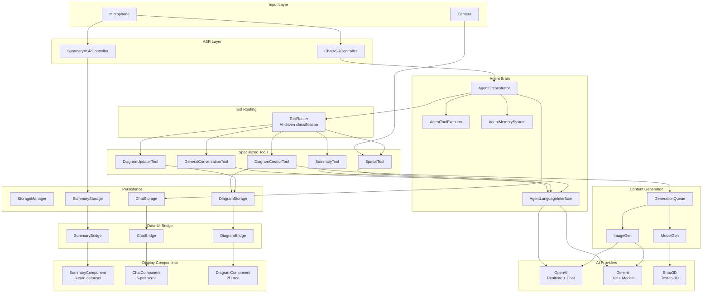
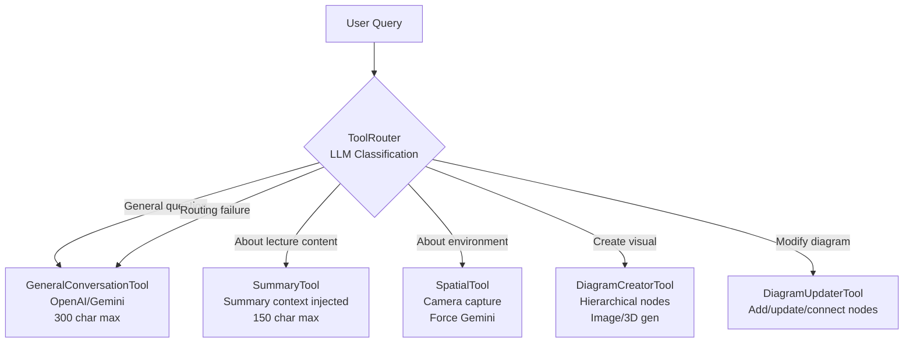
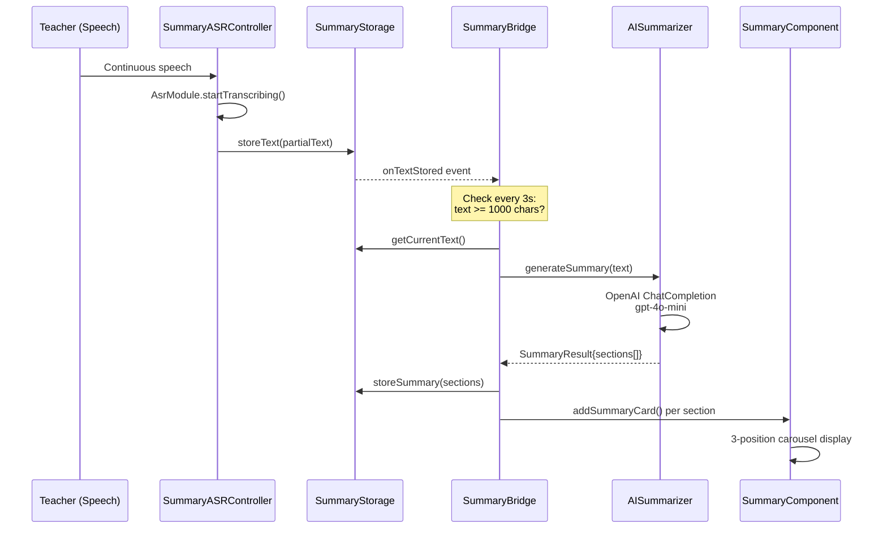
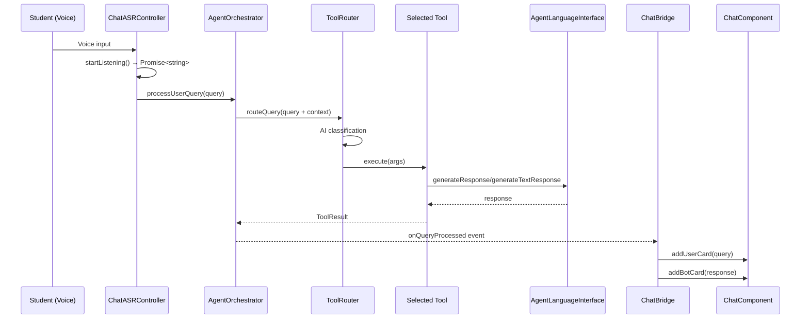
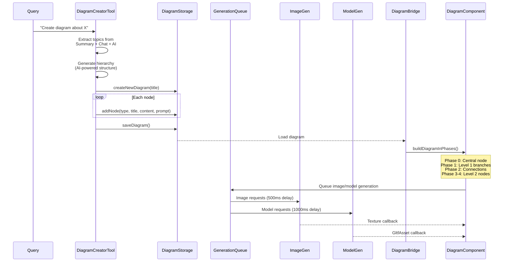
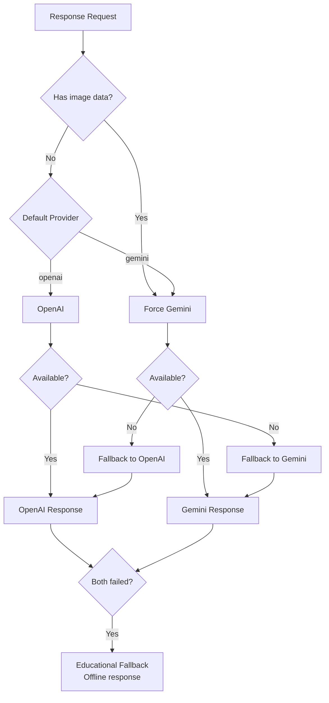

# Knowledge: AgenticMinder - Smart Glass AI Application

## Overview

**AgenticMinder** (internally "Agentic Playground") is an AI-powered educational AR assistant built for **Snap Spectacles** smart glasses. It runs intelligent AI agents directly on the glasses, enabling real-time lecture summarization, conversational AI, spatial environment analysis, and interactive 3D diagram visualization.

- **Language**: TypeScript (ES2021 target, commonjs modules)
- **Platform**: Snap Spectacles (Lens Studio v5.15.0+, Spectacles OS v5.64+)
- **AI Providers**: OpenAI (GPT-4o, Realtime API), Google Gemini (2.0 Flash, Live API), Snap3D, DeepSeek
- **Architecture**: Agent-based with intelligent tool routing (no hardcoded rules)
- **Storage**: 10MB persistent device storage
- **Core Design**: Three parallel systems (Summary, Chat, Diagram) unified by an agent orchestrator

### Strategic Context

This is the **smart glass application layer** of the AgenticMinder ecosystem. It captures raw data from smart glasses (camera images, voice, text) and processes it through AI agents. The target is to:
1. Bridge the gap between the smart glass app and the **OpenClaw core agent** through gateway connectivity
2. Customize for any smart glass manufacturer (Spectacles, Meta Ray-Ban, etc.)
3. Enable cross-device connectivity via gateway modification

---

## Project Structure

```
AgenticMinder/
├── Assets/
│   └── AgenticPlayground/
│       ├── Scripts/                    # 48 TypeScript source files ★
│       │   ├── Agents/                 # Agent orchestration layer (5 files)
│       │   │   ├── AgentOrchestrator.ts      # Central coordinator
│       │   │   ├── AgentLanguageInterface.ts # Unified AI provider abstraction
│       │   │   ├── AgentToolExecutor.ts      # Tool lifecycle manager
│       │   │   ├── AgentMemorySystem.ts      # Persistent memory (10MB)
│       │   │   └── AgentTypes.ts             # All interfaces & types
│       │   ├── Tools/                  # Intelligent tool system (6 files)
│       │   │   ├── ToolRouter.ts             # AI-powered tool selection
│       │   │   ├── GeneralConversationTool.ts # Default Q&A
│       │   │   ├── SummaryTool.ts            # Lecture-specific Q&A
│       │   │   ├── SpatialTool.ts            # Camera-based env analysis
│       │   │   ├── DiagramCreatorTool.ts     # Visual diagram generation
│       │   │   └── DiagramUpdaterTool.ts     # Diagram modification
│       │   ├── Core/                   # AI provider integration (8 files)
│       │   │   ├── OpenAIAssistant.ts        # GPT + Realtime API
│       │   │   ├── GeminiAssistant.ts        # Gemini + Live API
│       │   │   ├── AISummarizer.ts           # Lecture summarization
│       │   │   ├── ImageGen.ts               # DALL-E 3 / Gemini image gen
│       │   │   ├── ModelGen.ts               # Snap3D text-to-3D
│       │   │   ├── ImageGenBridge.ts         # Image gen UI orchestration
│       │   │   ├── ModelGenBridge.ts         # 3D model UI orchestration
│       │   │   └── GenerationQueueInitializer.ts # Queue setup
│       │   ├── ASR/                    # Speech-to-text (2 files)
│       │   │   ├── SummaryASRController.ts   # Continuous lecture capture
│       │   │   └── ChatASRController.ts      # Turn-based chat voice input
│       │   ├── Storage/                # Data persistence (4 files)
│       │   │   ├── StorageManager.ts         # Central storage coordinator
│       │   │   ├── SummaryStorage.ts         # Lecture transcripts + summaries
│       │   │   ├── ChatStorage.ts            # Conversation history + sessions
│       │   │   └── DiagramStorage.ts         # Diagram definitions + nodes
│       │   ├── Components/             # UI rendering + bridges (6 files)
│       │   │   ├── SummaryComponent.ts       # 3-position card carousel
│       │   │   ├── ChatComponent.ts          # 5-position chat scroll
│       │   │   ├── DiagramComponent.ts       # 2D tree visualization
│       │   │   ├── SummaryBridge.ts          # Summary data-UI bridge
│       │   │   ├── ChatBridge.ts             # Chat data-UI bridge
│       │   │   └── DiagramBridge.ts          # Diagram data-UI bridge
│       │   ├── Nodes/                  # Diagram node types (3 files)
│       │   │   ├── TextNode.ts               # Rich text node
│       │   │   ├── ImageNode.ts              # Generated image node
│       │   │   └── ModelNode.ts              # 3D model node
│       │   └── Utils/                  # Helpers (13 files)
│       │       ├── GenerationQueue.ts        # Request prioritization
│       │       ├── GenerationQueueDebugger.ts
│       │       ├── ModelGenerationScheduler.ts
│       │       ├── TextLimiter.ts            # AR display char limits
│       │       ├── TreeStructureUtils.ts     # Hierarchical positioning
│       │       ├── MindMapSpatialUtils.ts    # Spatial layout algorithms
│       │       ├── MindNodeBehaviors.ts      # Node animation behaviors
│       │       ├── Line3D.ts                 # 3D tube mesh connections
│       │       ├── ChatExtensions.ts         # Chat component API
│       │       ├── SummaryExtensions.ts      # Summary component API
│       │       ├── DiagramExtensions.ts      # Diagram component API
│       │       ├── APIKeyHint.ts             # Credential check
│       │       └── InternetAvailabilityPopUp.ts
│       ├── Materials/                  # 24 shader/material files
│       ├── Prefabs/                    # 32 scene component prefabs
│       ├── Textures/                   # 11 texture directories
│       └── Visuals/                    # 11 visual asset directories
│
├── Packages/                           # External dependencies (.lspkg)
│   ├── RemoteServiceGateway.lspkg      # AI service gateway ★
│   ├── SpectaclesInteractionKit.lspkg  # Interaction framework
│   ├── SpectaclesUIKit.lspkg           # UI components
│   └── LSTween.lspkg                   # Animation tweening
│
├── Context/                            # Reference documentation
│   ├── asr-module.md                   # ASR capabilities (40+ languages)
│   ├── persistent-storage.md           # Storage architecture
│   ├── remote-service-gateway.md       # AI gateway docs ★
│   ├── websocket.md                    # WebSocket protocol
│   └── tutorial-script.md              # System walkthrough
│
├── docs/ai/                            # AI DevKit phase docs
│   ├── requirements/                   # Problem understanding
│   ├── design/                         # Architecture decisions
│   ├── planning/                       # Task breakdown
│   ├── implementation/                 # Implementation guides
│   ├── testing/                        # Testing strategy
│   └── riper-5-mode/                   # RIPER-5-MODE protocol
│
├── .agent/workflows/                   # 12 agent workflow guides
├── .claude/commands/                   # 12 Claude Code commands
├── openclaw/                           # Core agent (see knowledge-openclaw.md)
│
├── CLAUDE.md                           # AI DevKit rules
├── AGENTS.md                           # Agent system rules
├── .ai-devkit.json                     # AI DevKit config (v0.11.0)
└── tsconfig.json                       # TypeScript config
```

---

## Implementation Details

### Architecture Layers

The application has **9 distinct layers** that form a pipeline from raw input to displayed output:

```
┌───────────────────────────────────────────────────────────────┐
│  Layer 1: Input (ASR)                                         │
│  SummaryASRController │ ChatASRController                     │
│  Microphone → Speech-to-Text → Query String                  │
├───────────────────────────────────────────────────────────────┤
│  Layer 2: Orchestration (Agent Brain)                         │
│  AgentOrchestrator                                            │
│  Query validation → Context gathering → Tool dispatch         │
├───────────────────────────────────────────────────────────────┤
│  Layer 3: Routing (Intelligence)                              │
│  ToolRouter (AI-driven, no hardcoded rules)                   │
│  Query → LLM classification → Tool selection                  │
├───────────────────────────────────────────────────────────────┤
│  Layer 4: Tools (Specialized Capabilities)                    │
│  GeneralConversation │ Summary │ Spatial │ DiagramCreator     │
│  Each tool has its own system prompt + response format        │
├───────────────────────────────────────────────────────────────┤
│  Layer 5: AI Providers (External APIs)                        │
│  AgentLanguageInterface (unified abstraction)                 │
│  OpenAIAssistant (Realtime) │ GeminiAssistant (Live)          │
├───────────────────────────────────────────────────────────────┤
│  Layer 6: Generation (Content Creation)                       │
│  ImageGen (DALL-E/Gemini) │ ModelGen (Snap3D)                 │
│  GenerationQueue │ ModelGenerationScheduler                   │
├───────────────────────────────────────────────────────────────┤
│  Layer 7: Storage (Persistence)                               │
│  StorageManager → SummaryStorage │ ChatStorage │ DiagramStorage│
│  10MB device limit, auto-truncation, cross-session            │
├───────────────────────────────────────────────────────────────┤
│  Layer 8: Bridge (Data-UI Integration)                        │
│  SummaryBridge │ ChatBridge │ DiagramBridge                   │
│  Storage events → UI updates, display logic                   │
├───────────────────────────────────────────────────────────────┤
│  Layer 9: UI Components (Display)                             │
│  SummaryComponent (3-card carousel)                           │
│  ChatComponent (5-position scroll)                            │
│  DiagramComponent (2D tree with collision avoidance)          │
└───────────────────────────────────────────────────────────────┘
```

---

### Core Type System (AgentTypes.ts)

All layers share a common type system:

```typescript
// Central system state
SystemState {
  currentStep: "idle" | "summary" | "chat" | "diagram"
  summaryData: SummaryData
  chatHistory: ChatMessage[]
  diagramState: DiagramState
  sessionId: string
  timestamp: number
}

// Chat conversation turn
ChatMessage {
  id: string
  type: "user" | "bot"
  content: string
  timestamp: number
  cardIndex: number        // -1 if not linked to summary card
  relatedTools: string[]   // Which tools generated this
}

// LLM communication message
Message {
  role: "system" | "user" | "assistant" | "tool"
  content: string
  name?: string
  imageData?: string       // Base64 for multimodal (camera feed)
}

// Tool contract - all tools implement this
Tool {
  name: string
  description: string
  parameters: any          // JSON Schema
  execute(args: Record<string, unknown>): Promise<ToolResult>
}

ToolResult {
  success: boolean
  result?: any
  error?: string
  executionTime: number
}

// Diagram visualization
DiagramNode {
  id: string
  type: "text" | "image" | "model"
  content: string
  position: vec3           // 3D spatial position
  level: 0 | 1 | 2
  parentId?: string
  generatedContent?: GeneratedContent
}

// Educational session
LearningSession {
  id: string; startTime: number; endTime: number
  type: "lecture" | "study" | "review"
  educationalContext: EducationalContext
  state: SystemState
}
```

---

### Agent Orchestrator (AgentOrchestrator.ts)

The central coordinator that manages the complete agent flow.

**Key Configuration:**
```typescript
@input conversationContextMessages: number = 10   // Context window
@input toolTimeout: number = 15000                 // 15s per tool
@input maxRetries: number = 3
@input defaultProvider: string = "openai"          // or "gemini"
@input enableVoiceOutput: boolean = true
TRANSCRIPTION_SILENCE_TIMER = 2000                 // ms silence = voice complete
```

**Processing Flow:**
```
processUserQuery(query, context?)
  → Validate: enabled? initialized? not busy?
  → Gather context: conversation history + summary data
  → Execute tool: ToolRouter.routeQuery(args)
  → Parse result: extract .result, .message, or .response
  → Voice mode: accumulate transcription via onTextUpdate events
  → Text mode: optionally speak via languageInterface.speak()
  → Store: ChatStorage + AgentMemorySystem
  → Events: onQueryProcessed, onVoiceCompleted
  → Return: response string
```

**Voice Mode Architecture:**
- **Native Voice Mode** (GeneralConversationTool): Returns `"[Voice response - transcription pending]"`, text streamed via audio, transcription accumulated via events, 2s silence triggers completion
- **Text-First Mode** (SummaryTool): Text response generated, then re-injected as prompt for audio playback

---

### Intelligent Tool Routing (ToolRouter.ts)

AI-powered tool selection using LLM reasoning (not keyword matching).

**Registered Tools:**

| Tool | Name | Purpose | Key Constraint |
|------|------|---------|----------------|
| GeneralConversationTool | `general_conversation` | Default Q&A | 300 char max, temp 0.8 |
| SummaryTool | `summary_tool` | Lecture context Q&A | 150 char max, temp 0.7 |
| SpatialTool | `spatial_tool` | Camera environment analysis | Forces Gemini, camera capture |
| DiagramCreatorTool | `diagram_creator` | Create visual diagrams | Hierarchical structure gen |
| DiagramUpdaterTool | `diagram_updater` | Modify existing diagrams | Node add/update/connect |

**Routing Process:**
```
1. Build rich context with all tool descriptions + capabilities + use-cases
2. Include current summary context for informed routing
3. Send to LLM: "Which tool should handle this query?"
4. Parse AI decision → tool name
5. Execute selected tool with query + context
6. Fallback: general_conversation on routing failure
```

**Tool Registration Pattern (for adding new tools):**
```typescript
const myTool = new MyTool(languageInterface)
this.indexTool("my_tool", {
  name: "my_tool",
  description: "...",
  capabilities: ["..."],
  useWhen: ["..."],
  instance: myTool
})
```

---

### AI Provider Abstraction (AgentLanguageInterface.ts)

Unified interface abstracting OpenAI and Gemini with intelligent provider selection.

**Provider Selection Logic:**
- Image data in message → Force Gemini (multimodal advantage)
- Provider unavailable → Automatic fallback
- Default configurable: `"openai"` or `"gemini"`

**Two Response Modes:**
1. **generateResponse()** (Voice-enabled): Uses Live/Realtime APIs, streams audio, returns transcription pending placeholder
2. **generateTextResponse()** (Text-only): Uses Models APIs (GPT-4o-mini / Gemini 2.0 Flash), direct text return

**Key Constants:**
```typescript
TEXT_RESPONSE_TIMEOUT = 10000    // 10s for AI response
SILENCE_TIMEOUT = 1500           // 1.5s silence = complete
LENGTH_LIMIT = 280               // Auto-complete at 280 chars
```

**API Models Used:**
- OpenAI: `gpt-4o-mini` (tools), `gpt-4o` (fallback), `gpt-4o-mini-realtime-preview` (voice)
- Gemini: `gemini-2.0-flash` (tools), `gemini-1.5-pro` (fallback), `gemini-2.0-flash-live-preview` (voice+video)

---

### AI Providers (OpenAIAssistant.ts, GeminiAssistant.ts)

**OpenAI Realtime API:**
```
Microphone → AudioProcessor → WebSocket → gpt-4o-mini-realtime-preview
  → Text streaming via updateTextEvent
  → Audio streaming via DynamicAudioOutput
  → Tool calls via functionCallEvent (Snap3D model gen)
```

**Gemini Live API:**
```
Microphone → AudioProcessor → WebSocket → gemini-2.0-flash-live-preview
Video → VideoController (1500px JPEG, HighQuality) → Same WebSocket
  → Text streaming via updateTextEvent
  → Audio streaming via DynamicAudioOutput
  → Spatial awareness via video context
```

**Key Difference:** Gemini handles both audio + video simultaneously, enabling spatial awareness from camera feed.

---

### Content Generation Pipeline

**Image Generation (ImageGen.ts):**
- OpenAI: DALL-E 3 (URL or base64 → Texture)
- Gemini: 2.0 Flash Image Gen (base64 → Texture)
- Runtime provider switching supported

**3D Model Generation (ModelGen.ts):**
- Snap3D API with progressive streaming:
  1. Submit prompt → Event stream starts
  2. `"image"` event → Preview texture callback
  3. `"base_mesh"` event → Initial 3D model (isFinal=false)
  4. `"refined_mesh"` event → Final 3D model (isFinal=true)
- Multi-callback support (Map<callbackId, callback>) for multi-node scenarios

**Generation Queue (GenerationQueue.ts):**
- Singleton with dual queues (images + models)
- Concurrency limits: images 1-3, models 1-2 (default 1 each)
- Inter-request delays: 500ms (images), 1000ms (models) to avoid rate limits
- Priority-based scheduling via ModelGenerationScheduler

---

### Storage System

**StorageManager.ts** coordinates three isolated storage backends:

| Storage | Purpose | Key Data | Events |
|---------|---------|----------|--------|
| SummaryStorage | Transcripts + AI summaries | `currentText`, `sections[]`, `summaries[]` | `onTextStored`, `onSummaryGenerated` |
| ChatStorage | Conversations + sessions | `sessions[]`, `messages[]`, `toolsUsed[]` | `onMessageAdded`, `onSessionStarted` |
| DiagramStorage | Diagram definitions | `nodes[]`, `diagramTitle`, `documentString` | N/A (direct save/load) |

**Persistence:** Uses `global.persistentStorageSystem.store` API with `putString`/`getString` methods. All data JSON-serialized.

**AgentMemorySystem.ts** provides an additional in-memory layer with:
- LLM message history (max 500, truncate to 250)
- Chat history (max 100, truncate to 50)
- Learning session tracking (lecture/study/review)
- Storage keys prefixed: `agentflow_*`

**Storage Limits:**
- Total: 10MB max
- Per-component: 2.5MB max (25% of limit, triggers truncation)
- Sessions: max 10 stored, 200 messages per session

---

### ASR (Speech-to-Text) Layer

**SummaryASRController.ts** - Continuous lecture capture:
- Accumulates text incrementally via `AsrModule.startTranscribing()`
- Silence detection: 3000ms (configurable `silenceUntilTerminationMs`)
- Max session: 3600 seconds
- Stores partial transcriptions when > 100 chars (workaround)

**ChatASRController.ts** - Turn-based chat voice:
- Returns Promise<string> from `startListening()`
- Routes query to `AgentOrchestrator.processUserQuery()`
- Silence detection: 2000ms (shorter for conversational input)
- Session timeout: 300 seconds (5 minutes)

**ASR Capabilities** (from Context/asr-module.md):
- 40+ language support, mixed language input
- Modes: HighAccuracy | Balanced | HighSpeed
- Available on Spectacles OS v5.61+

---

### UI Component Architecture

**SummaryComponent.ts** - 3-position card carousel:
```
[Left -15°]  [Center 0°]  [Right +15°]
Swipe gesture detection → animation to next/prev card
Card limits: title 157 chars, content 785 chars
```

**ChatComponent.ts** - 5-position vertical scroll:
```
[TopLast] [Top] [Mid] [Bottom] [BottomLast]
Chronological: oldest→newest (bottom→top)
Dynamic card sizing based on text length
User cards: 200 char max, Bot cards: 300 char max
```

**DiagramComponent.ts** (1775 lines, largest file) - 2D tree visualization:
- Node types: TextNode, ImageNode, ModelNode, StartingNode
- Hierarchical: Level 0 (root) → Level 1 (branches) → Level 2 (sub-branches)
- Collision avoidance: Y-axis separation with EaseInOutCubic animation
- Visual vs logical positioning (nodeYOffset for display elevation)
- Max branches per node: 1-4 (configurable)
- Manipulation reset: nodes snap back to original position on release

**Bridge Layer** connects Storage ↔ Components:
- **SummaryBridge**: Auto-summary every 3s when text >= threshold (1000 chars)
- **ChatBridge**: Handles both text and voice completion events from orchestrator
- **DiagramBridge**: Phased tree building (0-4 phases, progressive construction)

---

### Character Limits (AR Display Optimization)

| Context | Limit | Rationale |
|---------|-------|-----------|
| Summary card title | 157 chars | Card header readability |
| Summary card content | 785 chars | Rich card body |
| User chat card | 200 chars | Message bubble fitting |
| Bot chat card | 300 chars | Response display |
| OpenAI system instruction | 300 chars | Educational context |
| Summary Tool response | 150 chars | Ultra-compact for AR |
| Text node title | 50 chars | Diagram node header |
| Text node content | 200 chars | Diagram node body |
| Image/model prompt | 150 chars | Generation specification |
| Max diagram nodes | 50 | Performance limit |

---

## Dependencies

### External Packages (.lspkg)

| Package | Purpose |
|---------|---------|
| **RemoteServiceGateway.lspkg** | AI service gateway (OpenAI, Gemini, DeepSeek, Snap3D) |
| **SpectaclesInteractionKit.lspkg** | Event system, timing utilities, interaction framework |
| **SpectaclesUIKit.lspkg** | UI components (cards, slides, layouts) |
| **LSTween.lspkg** | Animation tweening (easing functions) |

### AI Service Dependencies

| Service | Used For | API Pattern |
|---------|----------|-------------|
| **OpenAI Realtime API** | Voice conversation (gpt-4o-mini-realtime-preview) | WebSocket streaming |
| **OpenAI Chat Completions** | Text generation (gpt-4o-mini) | REST API |
| **OpenAI Image Generation** | DALL-E 3 images | REST API |
| **Gemini Live API** | Voice + video conversation (gemini-2.0-flash-live-preview) | WebSocket streaming |
| **Gemini Models API** | Text + multimodal (gemini-2.0-flash) | REST API |
| **Snap3D** | Text-to-3D model generation (GLB format) | REST + Event streaming |

### Platform Dependencies

- **Lens Studio** v5.15.0+
- **Spectacles OS** v5.64+
- **ASR Module** (Spectacles OS v5.61+)
- **RemoteMediaModule** (base64 texture decoding)
- **InternetModule** (URL resource loading)
- **VideoController** (camera frame capture)
- **AudioProcessor** / **DynamicAudioOutput** / **MicrophoneRecorder**
- **global.persistentStorageSystem** (device storage)

---

## Visual Diagrams

### Complete Data Flow



### Tool Routing Decision Flow



### Summary System Pipeline



### Chat System Pipeline



### Diagram Generation Pipeline



### Provider Fallback Architecture



---

## Additional Insights

### Key Architectural Patterns

| Pattern | Usage |
|---------|-------|
| **Singleton** | GenerationQueue, ModelGenerationScheduler |
| **Observer/Event** | All inter-layer communication via `Event<T>` |
| **Strategy** | Multiple node types, positioning algorithms, AI providers |
| **Factory** | MindNodeBehaviorFactory for node animations |
| **Bridge** | SummaryBridge, ChatBridge, DiagramBridge separate logic from UI |
| **Extension** | ChatExtensions, DiagramExtensions, SummaryExtensions provide public APIs to private internals |
| **Queue/Priority** | GenerationQueue (FIFO + concurrency), ModelGenerationScheduler (priority) |

### Remote Service Gateway

The critical infrastructure enabling AI on smart glasses:
- Solves the Spectacles constraint: cannot access sensitive data (camera, audio) AND internet simultaneously
- Gateway acts as secure proxy, handling auth via tokens (generated in Lens Studio)
- Token tied to Snapchat account, no expiration, can be revoked
- Supports: OpenAI, Gemini, DeepSeek, Snap3D
- WebSocket support via `remoteServiceModule.createWebSocket('wss://...')`

### Smart Glass Integration Points

For bridging to OpenClaw gateway and expanding to other devices:

1. **Gateway Connectivity**: The `RemoteServiceGateway.lspkg` package and WebSocket support provide the foundation for connecting to OpenClaw's `ws://127.0.0.1:18789` control plane
2. **Multi-modal Pipeline**: Camera (VideoController) + Microphone (AudioProcessor) + Display (Components) form a complete I/O pipeline adaptable to any glass hardware
3. **Tool Extension**: New tools can be added to ToolRouter for device-specific capabilities (e.g., SmartGlassTool for AR-specific interactions)
4. **Provider Abstraction**: AgentLanguageInterface already abstracts providers; adding OpenClaw as a provider follows the same pattern
5. **Storage Portability**: PersistentStorageSystem has both local and cloud variants; cloud storage enables cross-device state sync

### Risks & Considerations

| Risk | Impact | Mitigation |
|------|--------|------------|
| **Character limits** | Strict AR display constraints (150-785 chars) | TextLimiter enforced at every layer |
| **API rate limiting** | Generation queue delays (500ms-1000ms) | Concurrency controls + priority queue |
| **10MB storage limit** | Cross-session data loss on overflow | Auto-truncation at 2.5MB per component |
| **Single provider token** | Revocation affects all lenses | Token management best practices |
| **Platform lock-in** | Currently Spectacles-specific (Lens Studio + .lspkg) | Abstraction layers enable portability |
| **Voice mode complexity** | Two different voice paths (native vs text-first) | Tracked via explicit mode flag |

### Known Issues

- **GeminiAssistant.ts**: Typo in error message "internete" instead of "internet" (line ~134)
- **Audio sample rate**: Gemini configured with 16000 Hz sample rate but audio processor may use 24000 Hz
- **ChatASRController**: Multiple workarounds to prevent animation interference from error callbacks

---

## Metadata

| Field | Value |
|-------|-------|
| **Analysis Date** | 2026-02-16 |
| **Entry Point** | `AgenticMinder/` (excluding `openclaw/`) |
| **Depth** | Full codebase analysis |
| **Files Analyzed** | 48 TypeScript source files + 5 context docs + configs |
| **Total LOC** | ~10,000+ across all scripts |
| **Related Knowledge** | `knowledge-openclaw.md` (core agent platform) |

---

## Next Steps

### Recommended Deep-Dives

1. **Gateway Bridge Implementation**: Design the WebSocket bridge between RemoteServiceGateway and OpenClaw's gateway protocol (v3 frames: Connect, HelloOk, req, res, event)
2. **Device Abstraction Layer**: Create an abstraction over Spectacles-specific APIs (VideoController, AudioProcessor, ASR) to enable portability to Meta Ray-Ban and other devices
3. **Cross-Device Storage**: Investigate Cloud Persistent Storage for syncing state between smart glass and OpenClaw host
4. **New Tool: SmartGlassTool**: Implement a tool for AR-specific interactions (object recognition, spatial anchoring, gesture-based navigation)
5. **Performance Profiling**: Benchmark the full pipeline latency from voice input to displayed response on actual Spectacles hardware

### Recommended `/capture-knowledge` Runs

- `/capture-knowledge` on `Assets/AgenticPlayground/Scripts/Agents/` for deeper agent internals
- `/capture-knowledge` on `Packages/RemoteServiceGateway.lspkg/` for gateway API details
- `/capture-knowledge` on `openclaw/src/gateway/` for OpenClaw gateway protocol specifics
