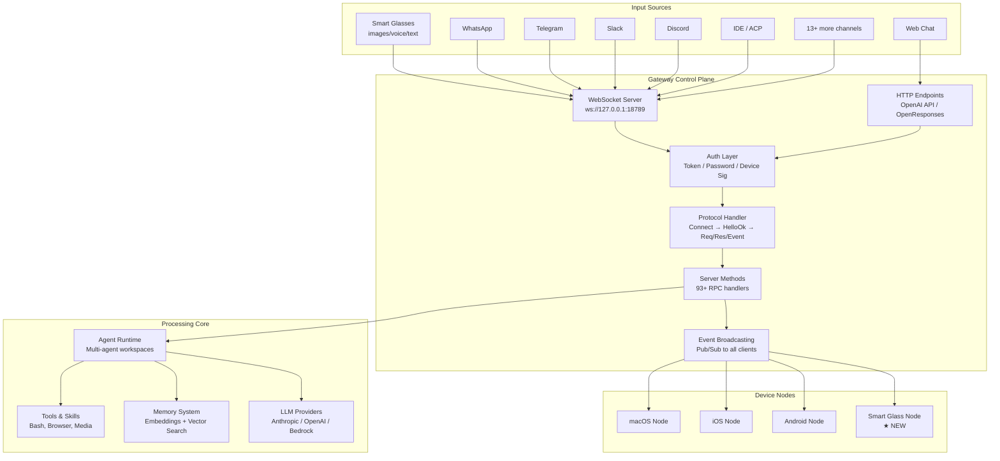
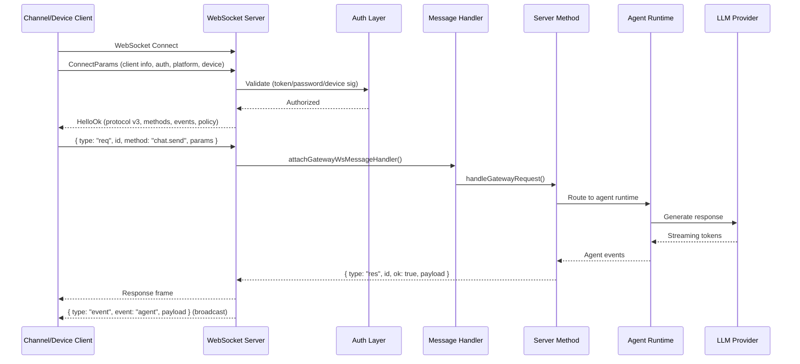
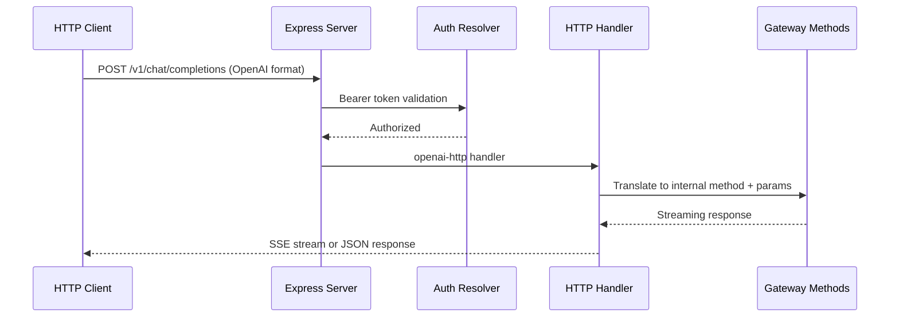
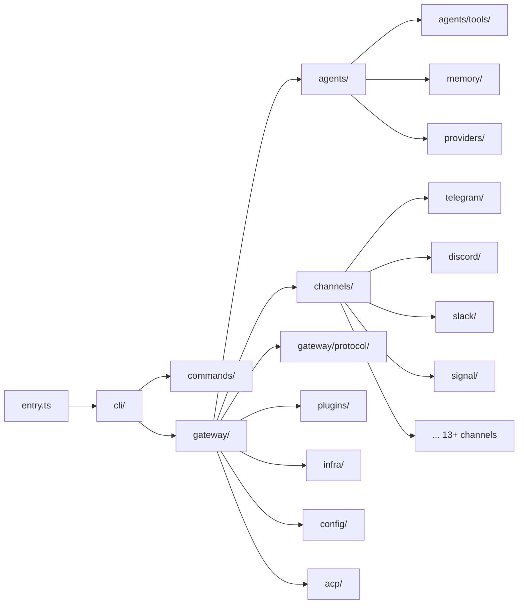
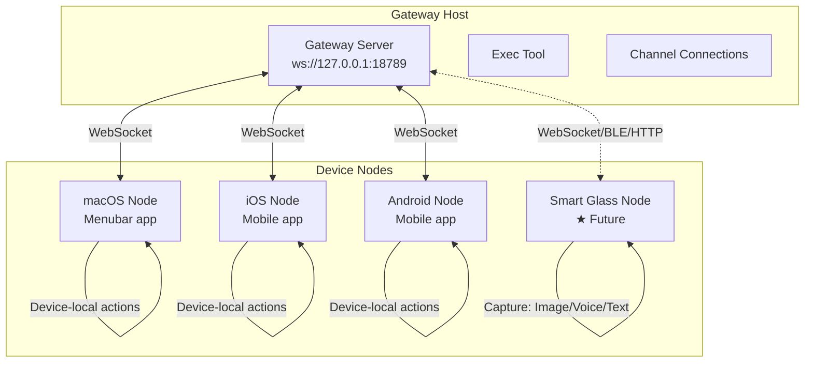
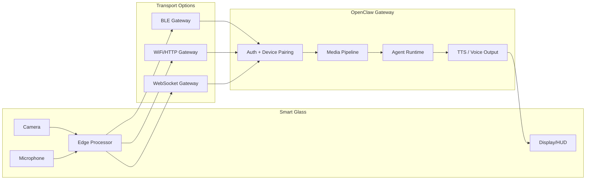

# Knowledge: OpenClaw - Core Agent Platform

## Overview

**OpenClaw** is a multi-channel AI gateway and personal assistant platform designed to run locally on user devices. It serves as the **core agent** of the AgenticMinder application. The platform connects to 20+ messaging channels (WhatsApp, Telegram, Slack, Discord, Signal, iMessage, Teams, Matrix, etc.) through a centralized WebSocket-based control plane.

- **Language**: TypeScript (ESM, strict typing)
- **Runtime**: Node.js >= 22
- **Package Manager**: pnpm (monorepo)
- **Version**: Date-based (2026.2.16)
- **License**: MIT
- **Primary Transport**: WebSocket at `ws://127.0.0.1:18789`

### Strategic Context

The target is to leverage this core agent to integrate with **smart glasses**, enabling it to process raw data captured from the device (images, voice, text) and route it through the gateway for AI-powered responses.

---

## Implementation Details

### Monorepo Structure

```
openclaw/
├── apps/                    # Mobile & desktop clients
│   ├── android/             # Kotlin/Gradle Android app
│   ├── ios/                 # Swift iOS app (XcodeGen + Fastlane)
│   ├── macos/               # Swift macOS menubar app (SPM)
│   └── shared/              # Cross-platform shared code
├── extensions/              # 38+ plugin packages (channels, memory, AI)
├── packages/                # Compatibility shims (clawdbot, moltbot)
├── src/                     # Main source (68+ subdirectories)
│   ├── gateway/             # WebSocket control plane (153 files) ★
│   ├── agents/              # AI agent routing & tools (355 files) ★
│   ├── channels/            # Channel abstraction layer (31 files) ★
│   ├── acp/                 # Agent Client Protocol for IDE integration
│   ├── cli/                 # CLI commands system (117 files)
│   ├── commands/            # High-level command implementations (211 files)
│   ├── config/              # Configuration management (143 files)
│   ├── memory/              # Embeddings & vector search (65 files)
│   ├── browser/             # Headless browser automation (86 files)
│   ├── media/               # Media pipeline (images, audio, video)
│   ├── infra/               # Infrastructure utilities (183 files)
│   ├── plugins/             # Plugin system (49 files)
│   ├── providers/           # LLM provider integrations
│   ├── security/            # Auth & DM policy enforcement
│   ├── telegram/            # Telegram-specific (79 files)
│   ├── discord/             # Discord-specific (52 files)
│   ├── slack/               # Slack-specific (35 files)
│   ├── signal/              # Signal-specific (28 files)
│   ├── imessage/            # iMessage-specific (17 files)
│   ├── line/                # LINE-specific (43 files)
│   ├── whatsapp/            # WhatsApp-specific (5 files)
│   ├── web/                 # Web chat interface
│   ├── auto-reply/          # Auto-reply system (79 files)
│   ├── cron/                # Scheduled tasks (46 files)
│   ├── tui/                 # Terminal UI
│   └── logging/             # Structured logging
├── ui/                      # Lit-based web Control UI (Vite)
├── skills/                  # Bundled skills (53 dirs)
├── docs/                    # Documentation (44 dirs)
├── scripts/                 # Build & maintenance (79 files)
├── test/                    # Test infrastructure
└── pnpm-workspace.yaml      # Workspace root config
```

### Key Entry Points

| File | Purpose |
|------|---------|
| `src/entry.ts` | CLI bootstrap with respawning logic and Node options |
| `src/index.ts` | Main module export + CLI program initialization |
| `src/gateway/server.impl.ts` | Gateway server startup (726 LOC) |
| `src/gateway/server-chat.ts` | Chat event routing and agent invocation |
| `src/gateway/protocol/index.ts` | Protocol message schemas (AJV validation) |
| `src/acp/server.ts` | ACP bridge for IDE integration |
| `src/agents/call.ts` | Agent invocation logic |
| `src/agents/client.ts` | Gateway client wrapper for agents |
| `src/channels/registry.ts` | Channel plugin registry |

---

## Data Flow

### High-Level Architecture



### Inbound Message Flow (WebSocket)



### HTTP Endpoint Flow



---

## Gateway Architecture (Core Focus)

### Protocol & Framing

The gateway implements a binary-safe, request-response protocol (version 3):

| Frame Type | Direction | Purpose |
|-----------|-----------|---------|
| `Connect` | Client → Server | Initial handshake with auth + device info |
| `HelloOk` | Server → Client | Protocol version, available methods/events, policy |
| `req` | Client → Server | RPC request (method name + params) |
| `res` | Server → Client | RPC response (payload or error) |
| `event` | Server → Client | Broadcast event to subscribed clients |
| `tick` | Server → Client | Heartbeat |
| `shutdown` | Server → Client | Graceful shutdown with restart timing |

**Key files**:
- `src/gateway/protocol/schema/frames.ts` - Frame type definitions
- `src/gateway/protocol/index.ts` - AJV schema validators
- `src/gateway/server/ws-connection.ts` - WebSocket transport layer
- `src/gateway/server/ws-connection/message-handler.ts` - Message processing

### Server Methods (93+ RPC Handlers)

Organized by category in `src/gateway/server-methods/`:

| Category | Key Methods |
|----------|-------------|
| **Chat** | `send`, `chat.send`, `chat.history`, `chat.abort`, `agent`, `agent.wait`, `wake` |
| **Nodes** | `node.list`, `node.describe`, `node.invoke`, `node.event`, `node.pair.*` |
| **Devices** | `device.pair.*`, `device.token.*` |
| **Sessions** | `sessions.list`, `sessions.preview`, `sessions.patch`, `sessions.reset` |
| **Config** | `config.get`, `config.set`, `config.patch`, `config.apply`, `config.schema` |
| **Agents** | `agents.list`, `agents.create`, `agents.update`, `agents.delete` |
| **Skills** | `skills.status`, `skills.bins`, `skills.install`, `skills.update` |
| **Health** | `health`, `status`, `usage.status`, `usage.cost`, `logs.tail` |
| **Models** | Model listing and provider management |
| **Cron** | Scheduled task management |

**Handler pattern**:
```typescript
type GatewayRequestHandler = (opts: GatewayRequestHandlerOptions) => Promise<void> | void;

type GatewayRequestHandlerOptions = {
  req: RequestFrame;
  params: Record<string, unknown>;
  client: GatewayClient | null;
  respond: RespondFn;
  context: GatewayRequestContext;
};
```

### Authentication & Authorization

| Auth Mode | Description |
|-----------|-------------|
| **None** | Local trusted connections (loopback) |
| **Token** | Bearer token verification |
| **Password** | Shared secret verification |
| **Trusted Proxy** | Loopback with proxy header trust |
| **Device Signature** | Public key crypto (mobile devices) |

**Scopes**: `operator.admin`, `operator.read`, `operator.write`, `operator.approvals`, `operator.pairing`

**Rate limiting**: Per-scope brute-force protection with configurable limits.

### Event Broadcasting

19+ event types including:
```
connect.challenge, agent, chat, presence, tick, talk.mode, shutdown, health,
heartbeat, cron, node.pair.*, device.pair.*, node.invoke.request,
voicewake.changed, exec.approval.*
```

**Broadcast methods**:
- `broadcast(event, payload)` - All connected clients
- `broadcastToConnIds(connIds, event, payload)` - Targeted
- `nodeSendToSession(sessionKey, event, payload)` - Node-specific
- `nodeSendToAllSubscribed(event, payload)` - Multicast to node subscribers

---

## Gateway Extension Points (Adding New Transports)

This is the critical section for smart glass integration. The architecture supports adding new gateway transports:

### Step 1: Transport Handler

Create a connection handler similar to `src/gateway/server/ws-connection.ts`:

```typescript
// src/gateway/server/smart-glass-connection.ts
export function attachSmartGlassConnectionHandler(params: {
  server: SmartGlassServer;
  clients: Set<SmartGlassClient>;
  resolvedAuth: ResolvedGatewayAuth;
  gatewayMethods: string[];
  events: string[];
  extraHandlers: GatewayRequestHandlers;
  broadcast: GatewayBroadcastFn;
  buildRequestContext: () => GatewayRequestContext;
}) {
  // Handle connection lifecycle
  // Receive ConnectParams
  // Send HelloOk
  // Route incoming requests to handleGatewayRequest()
  // Subscribe to broadcast events
}
```

### Step 2: Message Handler

Similar to `src/gateway/server/ws-connection/message-handler.ts`:

```typescript
// src/gateway/server/smart-glass-connection/message-handler.ts
export function attachSmartGlassMessageHandler(params: {
  connection: SmartGlassConnection;
  connId: string;
  send: (obj: unknown) => void;
  close: (reason?: string) => void;
}) {
  // Validate ConnectParams schema
  // Authorize connection
  // Handle incoming request frames
  // Route to server-methods handlers
  // Format and send responses
}
```

### Step 3: HTTP Endpoints (Optional)

For REST-based interactions from smart glass firmware:

```typescript
// src/gateway/smart-glass-http.ts
export async function handleSmartGlassHttpRequest(
  req: IncomingMessage,
  res: ServerResponse,
  opts: { auth, handlers, context }
) {
  // Parse multimodal request (image, audio, text)
  // Validate auth
  // Map to internal method + params
  // Call handleGatewayRequest()
  // Return formatted response
}
```

### Step 4: Register in server.impl.ts

```typescript
// src/gateway/server.impl.ts
import { attachSmartGlassConnectionHandler } from "./server/smart-glass-connection.js";

// After WebSocket server setup:
attachSmartGlassConnectionHandler({
  server: smartGlassServer,
  clients: smartGlassClients,
  resolvedAuth,
  gatewayMethods,
  events: GATEWAY_EVENTS,
  extraHandlers,
  broadcast,
  buildRequestContext,
});
```

### Step 5: Protocol Schema Extensions

```typescript
// src/gateway/protocol/schema/smart-glass.ts
export const SmartGlassRequestSchema = Type.Object({
  type: Type.Literal("smart-glass-input"),
  dataType: Type.Union([
    Type.Literal("image"),
    Type.Literal("voice"),
    Type.Literal("text")
  ]),
  payload: Type.Unknown(),
  metadata: Type.Optional(Type.Object({
    deviceId: Type.String(),
    timestamp: Type.Number(),
    sensorData: Type.Optional(Type.Unknown()),
  })),
});
```

---

## Dependencies

### Key External Dependencies

| Category | Package | Purpose |
|----------|---------|---------|
| **AI/LLM** | @agentclientprotocol/sdk | ACP for IDE integration |
| **AI/LLM** | openai | OpenAI provider |
| **AI/LLM** | @aws-sdk/client-bedrock | AWS Bedrock models |
| **AI/LLM** | @mariozechner/pi-* | Agent runtime |
| **Messaging** | grammy | Telegram bot framework |
| **Messaging** | @slack/bolt | Slack integration |
| **Messaging** | @whiskeysockets/baileys | WhatsApp Web client |
| **Messaging** | discord-api-types | Discord types |
| **Messaging** | @line/bot-sdk | LINE messaging |
| **Media** | sharp | Image processing |
| **Media** | node-edge-tts | Text-to-speech |
| **Media** | pdfjs-dist | PDF rendering |
| **Media** | playwright-core | Browser automation |
| **Data** | sqlite-vec | Vector database |
| **Data** | zod | Schema validation |
| **Data** | @sinclair/typebox | TypeBox schemas |
| **Web** | express | HTTP server |
| **Web** | ws | WebSocket library |

### Internal Module Dependencies



---

## Visual Diagrams

### Device Node Architecture



### Smart Glass Integration Points



---

## Additional Insights

### Design Patterns Used

1. **Gateway Pattern**: Centralized WebSocket control plane routing all communication
2. **Plugin Architecture**: Extensions as isolated npm packages with standardized interfaces
3. **Transport Agnostic Handlers**: Method handlers don't know about WebSocket/HTTP details
4. **Schema Validation**: TypeBox + AJV for runtime validation of all protocol messages
5. **Event-Driven Broadcasting**: Pub/sub pattern for real-time client updates
6. **Multi-Agent Routing**: Workspace isolation with per-agent session management
7. **Device Node Separation**: Gateway host vs device nodes for distributed execution
8. **Auth Layering**: Multiple auth levels (connect, rate limit, scope-based, device)

### Potential Risks for Smart Glass Integration

- **Latency**: WebSocket over WiFi may add latency for real-time glass interactions; BLE or local edge processing may be needed
- **Media Pipeline Load**: Continuous image/voice capture from glasses will stress the media pipeline; buffering and throttling strategies needed
- **Protocol Version**: Current protocol is v3; adding smart glass support may require v4 if breaking changes are needed
- **Authentication**: Device pairing flow (public key crypto) exists for mobile; smart glass may need a lighter handshake
- **Battery Impact**: Constant WebSocket connections drain mobile/glass batteries; consider polling or event-driven wakeup

### Existing Patterns to Leverage

- **Device Pairing**: `device.pair.*` and `device.token.*` methods already exist for mobile
- **Node Architecture**: `node.list`, `node.describe`, `node.invoke` methods support remote device actions
- **Media Pipeline**: `src/media/` handles images, audio, video with transcription hooks
- **Voice System**: Voice Wake + Talk Mode exists for macOS/iOS/Android
- **ACP Bridge**: Stdio-based protocol bridge pattern can be adapted for glass firmware

---

## Metadata

| Field | Value |
|-------|-------|
| **Analysis Date** | 2026-02-16 |
| **Analysis Depth** | 3 levels (folders → files → key implementations) |
| **Files Touched** | 1000+ files across 68+ subdirectories |
| **Entry Point Type** | Folder (monorepo root) |
| **Primary Focus** | Data flow, logic flow, gateway architecture |
| **Strategic Goal** | Smart glass integration for multimodal input processing |

---

## Next Steps

1. **Deep-dive into `src/gateway/server.impl.ts`** - Understand exact startup sequence and where to hook new transports
2. **Analyze `src/gateway/server/ws-connection.ts`** - Template for creating smart glass transport handler
3. **Study `src/gateway/protocol/schema/frames.ts`** - Understand frame definitions for protocol extension
4. **Review `src/infra/` device pairing** - Leverage existing device auth for smart glass pairing
5. **Examine `src/media/` pipeline** - Understand image/audio processing for continuous capture from glasses
6. **Study existing mobile apps** (`apps/android/`, `apps/ios/`) - Reference implementations for device node clients
7. **Run `/capture-knowledge`** on `src/gateway/` for deeper gateway-specific documentation
8. **Run `/capture-knowledge`** on `src/agents/` for agent runtime architecture details
