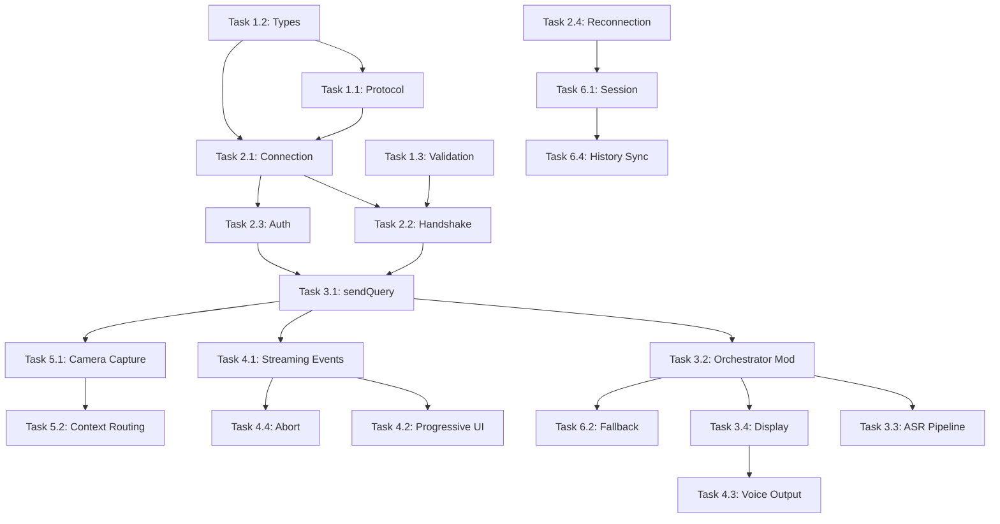

# Project Planning & Task Breakdown

## Milestones
**What are the major checkpoints?**

- [x] **Milestone 1: Protocol Foundation** — OpenClaw protocol v3 client implementation with frame handling
- [x] **Milestone 2: Connection & Auth** — WebSocket connection via InternetModule + device pairing
- [x] **Milestone 3: Core Query Bridge** — Text queries routed through OpenClaw with responses displayed
- [ ] **Milestone 4: Streaming & Voice** — Streaming response tokens + client-side TTS integration
- [ ] **Milestone 5: Multimodal Input** — Camera frame forwarding for spatial queries
- [ ] **Milestone 6: Session & Fallback** — Session continuity, reconnection, and direct-mode fallback
- [ ] **Milestone 7: Testing & Polish** — End-to-end testing, latency optimization, error handling

## Task Breakdown
**What specific work needs to be done?**

### Phase 1: Protocol Foundation
- [x] **Task 1.1: Create `OpenClawProtocol.ts`** — Frame serialization/deserialization, message ID generation, request-response correlation with 15s timeout, frame type discriminator, validation, error code mapping. (Notes: Integrated validation into same file as Task 1.3)
- [x] **Task 1.2: Define type interfaces** — Created `OpenClawTypes.ts` with all interfaces aligned to OpenClaw's actual protocol schemas. (Notes: Types verified against openclaw/src/gateway/protocol/schema/)
- [x] **Task 1.3: Implement frame validation** — Added `validateResponseFrame()`, `validateEventFrame()`, `validateFrameSize()`, and `getErrorMessage()` to OpenClawProtocol.ts. (Notes: Merged into OpenClawProtocol.ts)

### Phase 2: Connection & Authentication
- [x] **Task 2.1: Create `OpenClawBridge.ts` — connection lifecycle** — Singleton bridge with WebSocket via `InternetModule.createWebSocket()`, full connection state machine, open/close/error handlers. Server URL configurable via inspector or config. (Notes: Migrated from deprecated RemoteServiceModule to InternetModule. Requires Experimental APIs enabled for ws:// connections.)
- [x] **Task 2.2: Implement Connect handshake** — ConnectParams built with device info (client mode: 'node', platform: 'spectacles', deviceFamily: 'smart-glass'). HelloOk parsing extracts methods/events/auth token. (Notes: Fixed to handle connect.challenge event from server — waits up to 750ms for nonce before sending ConnectParams as a proper request frame. Connect is sent as `{type:"req", method:"connect"}`, not raw JSON. client.id must be from GATEWAY_CLIENT_IDS — using 'gateway-client'. Tested: full challenge-response handshake works.)
- [x] **Task 2.3: Create `OpenClawAuth.ts` — token management** — Device token storage/retrieval from PersistentStorage, device ID generation, ConnectParams builder, pairing event handling. (Notes: Simplified for dev mode — uses gateway shared token auth instead of ED25519 device signing. Spectacles lacks Node.js crypto for device signing, so token-only auth skips the device identity requirement. Added `setGatewayAuthToken()` + `openClawAuthToken` inspector input. Tested: token auth `celesnity-minder` connects successfully.)
- [x] **Task 2.4: Implement auto-reconnection** — Exponential backoff (1s→30s max), max 10 attempts with jitter, heartbeat monitoring (3 missed ticks → reconnect), shutdown event handling with timed reconnect.

### Phase 3: Core Query Bridge
- [x] **Task 3.1: Implement `sendQuery()` in OpenClawBridge** — Builds `chat.send` request with sessionKey, message, attachments (for camera), idempotencyKey. Tracks streaming text accumulation. Returns response text. (Notes: chat.send returns {status:"started"} immediately — actual response arrives async via "chat" events. sendQuery waits for streamResolve promise. Auto-fetches session key via sessions.list after connect. HelloOk field is `protocol` not `version`. Tested: "Hello, what is 2+2?" → "4" via Qwen.)
- [x] **Task 3.2: Modify `AgentOrchestrator.processUserQuery()`** — Added OpenClaw mode check before tool routing. When `connectionMode === 'openclaw'` and bridge connected, routes through `OpenClawBridge.sendQuery()`. Falls back to direct mode on failure. Added inspector inputs for enableOpenClaw, serverUrl, remoteServiceModule.
- [x] **Task 3.3: Wire ChatASRController → OpenClaw path** — No changes needed to ChatASRController — it already calls `AgentOrchestrator.processUserQuery()`, which now internally routes through OpenClaw when connected. (Notes: Pipeline is transparent to ASR)
- [x] **Task 3.4: Display OpenClaw response on AR** — OpenClaw text responses flow through existing `onQueryProcessed` event → ChatBridge → ChatComponent pipeline. Character limits enforced by maxResponseLength in GlassQuery. (Notes: No changes needed to ChatBridge/ChatComponent)

### Phase 4: Streaming & Voice Integration
- [ ] **Task 4.1: Handle streaming `agent` events** — Subscribe to EventFrame with `event: 'agent'` in OpenClawBridge. Emit `onStreamingResponse` events with partial text. Accumulate tokens until `done: true`.
- [ ] **Task 4.2: Progressive UI display** — Modify ChatBridge to subscribe to `OpenClawBridge.onStreamingResponse`. Update ChatComponent display progressively as tokens arrive (similar to current `updateTextEvent` handling).
- [ ] **Task 4.3: Client-side voice output** — When response complete, if voice mode enabled, use existing `AgentLanguageInterface.speak()` to convert text to voice via OpenAI TTS or Gemini. Leverage existing `DynamicAudioOutput` pipeline.
- [ ] **Task 4.4: Abort support** — Implement `abortQuery()` that sends `chat.abort` to OpenClaw. Wire to user interaction (e.g., tap gesture or new voice command "stop").

### Phase 5: Multimodal Input
- [ ] **Task 5.1: Camera frame capture for OpenClaw** — Reuse existing `VideoController` pattern from `SpatialTool.ts` to capture camera frame, encode as base64 JPEG (1500px, HighQuality). Include in `chat.send` params as `images` array.
- [ ] **Task 5.2: Context-aware query routing** — When user query + camera frame → OpenClawBridge, include frame data. When no camera needed → text-only query. Detect spatial intent from ASR keywords ("look at", "what is this", "read this").
- [ ] **Task 5.3: Image response handling** — If OpenClaw response includes generated images, route through existing `ImageGen` → `ImageNode` pipeline for display in diagram/chat.

### Phase 6: Session Management & Fallback
- [ ] **Task 6.1: Session persistence** — On successful OpenClaw connection, store `sessionKey` in PersistentStorage. On reconnect, send stored sessionKey in `Connect` params to resume session. Handle session expiry gracefully.
- [ ] **Task 6.2: Fallback to direct mode** — When OpenClaw connection fails after max retries, automatically switch `AgentOrchestrator.connectionMode` to 'direct'. Re-enable `ToolRouter` path. Periodically attempt OpenClaw reconnection in background (every 60s).
- [ ] **Task 6.3: Connection status UI** — Display connection state indicator on AR (small icon: green=connected, yellow=reconnecting, red=disconnected/fallback). Use existing component pattern.
- [ ] **Task 6.4: History sync** — On reconnect, optionally fetch recent `chat.history` from OpenClaw to populate local ChatStorage for display continuity.

### Phase 7: Configuration & Polish
- [x] **Task 7.1: Create `OpenClawConfig.ts`** — Default config values, PersistentStorage persistence for server URL. (Notes: Created early as it's referenced by other modules)
- [ ] **Task 7.2: Error handling & user feedback** — Map all OpenClaw error codes to user-visible messages. Display connection errors on AR. Add retry prompts. Handle edge cases (server full, auth revoked, protocol mismatch).
- [ ] **Task 7.3: Logging & diagnostics** — Add structured logging for connection lifecycle, query roundtrip times, error events. Toggle via config flag. Store recent logs in circular buffer for debugging.
- [ ] **Task 7.4: Performance optimization** — Minimize JSON serialization overhead. Batch camera frames if needed. Optimize reconnection timing. Profile end-to-end latency.

## Dependencies
**What needs to happen in what order?**

### Internal Dependencies

### External Dependencies
- **InternetModule**: Available in Lens Studio v5.9+ for WebSocket creation. Extended Permissions required for dev mode (camera+audio+internet simultaneously)
- **RemoteServiceGateway.lspkg**: Still needed for TTS via OpenAI `createSpeech` API — no changes needed
- **OpenClaw Server**: Must be running on local machine accessible on same WiFi network for dev phase
- **OpenClaw Protocol v3**: Must be stable — currently in use for CLI/browser clients
- **Lens Studio v5.15.0+**: Required for TypeScript ES2021 + Spectacles OS v5.64+ features
- **Extended Permissions**: Must be enabled in Lens Studio project settings for dev mode

## Timeline & Estimates
**When will things be done?**

| Phase | Tasks | Estimated Effort |
|-------|-------|-----------------|
| Phase 1: Protocol Foundation | 3 tasks | Small |
| Phase 2: Connection & Auth | 4 tasks | Medium |
| Phase 3: Core Query Bridge | 4 tasks | Medium-Large |
| Phase 4: Streaming & Voice | 4 tasks | Medium |
| Phase 5: Multimodal Input | 3 tasks | Medium |
| Phase 6: Session & Fallback | 4 tasks | Medium |
| Phase 7: Configuration & Polish | 4 tasks | Small-Medium |

**Critical path**: Phase 1 → Phase 2 → Phase 3 (must complete sequentially before others can start)

**Parallelizable**: Phase 4, 5, and 6 can proceed in parallel once Phase 3 is complete

## Risks & Mitigation
**What could go wrong?**

### Technical Risks

| Risk | Impact | Probability | Mitigation |
|------|--------|-------------|-----------|
| ~~RSG doesn't support arbitrary WebSocket~~ (**RESOLVED**) | ~~Blocker~~ | ~~Medium~~ | Using `InternetModule.createWebSocket()` with Extended Permissions for dev. `createAPIWebSocket` allowlisting for production. |
| `createAPIWebSocket` allowlisting denied by Snap for production | **Blocker for production** — dev works fine | Medium | Apply early. Alternative: proxy OpenClaw through an OpenAI-compatible API format via RSG, or distribute as non-published lens (enterprise sideload). |
| Extended Permissions mode has unexpected limitations | Medium — dev workflow affected | Low | Test Extended Permissions + InternetModule early in Phase 2. Verify camera+audio+WebSocket all work simultaneously. |
| OpenClaw protocol changes break client | High — connection failures | Low | Pin protocol version in Connect params. Handle version mismatch in HelloOk |
| Audio format mismatch (ASR vs. TTS vs. OpenClaw) | Medium — voice doesn't work | Low | ASR is text output (no audio format issue). TTS uses existing providers. Document format requirements |
| Spectacles hardware limitations (memory, CPU) | Medium — app crashes or stutters | Medium | Profile memory usage of WebSocket + JSON parsing. Implement message size limits. Lazy-load bridge module |
| Concurrent camera + network overwhelms bandwidth | Medium — frame drops, delays | Medium | Limit camera frame rate for OpenClaw queries (1 fps). Compress frames (JPEG quality 0.7). Skip frames if pending request exists |

### Dependency Risks

| Risk | Impact | Mitigation |
|------|--------|-----------|
| OpenClaw server not deployed/accessible | Blocker for testing | Set up test server early. Use mock server for unit tests |
| Snap's RemoteServiceGateway API changes | Medium | Pin Lens Studio version. Abstract RSG calls behind interface |
| OpenClaw adds required auth scopes for smart glass | Low | Monitor OpenClaw releases. Use flexible scope configuration |

## Resources Needed
**What do we need to succeed?**

### Infrastructure
- OpenClaw server deployed with `wss://` endpoint accessible from Snap Cloud
- SSL certificate for `wss://` connection
- Test environment with both Spectacles hardware and OpenClaw server

### Tools & Services
- Lens Studio v5.15.0+ for development and testing
- Spectacles device or emulator for on-device testing
- OpenClaw CLI client for protocol debugging
- Network proxy tool (e.g., mitmproxy) for WebSocket inspection

### Documentation
- `docs/ai/implementation/knowledge-agentic-minder.md` — AgenticMinder architecture reference
- `docs/ai/implementation/knowledge-openclaw.md` — OpenClaw protocol reference
- `Context/remote-service-gateway.md` — RemoteServiceGateway API documentation
- `Context/websocket.md` — WebSocket API on Spectacles
